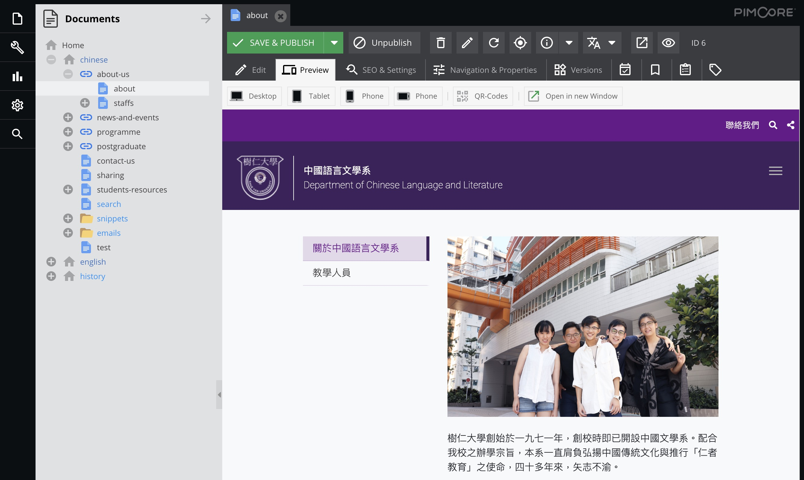

# The HKSYU CMS User Handbook

Welcome to the [HKSYU CMS](http://hksyu.dev.dq.hk/admin) user handbook. This document shows you how to use the CMS to manage the contents of HKSYU faculties And departments websites.

## The HKSYU faculties and departments websites
The following HKSYU faculties and departments websites are under the CMS management:

### Faculty of Arts
- Department of Chinese Language and Literature
- Department of English Language and Literature
- Department of History
- Department of Journalism and Communication

### Faculty of Commerce
- Department of Accounting
- Department of Business Administration
- Department of Economics and Finance
- Department of Law and Business

### Faculty of Social Sciences
- Department of Counselling and Psychology
- Department of Social Work
- Department of Sociology

### Graduate School
- Graduate School

---
## About the Pimcore CMS

This CMS was developed by [Design Quest Limited](https://designquest.com.hk) based on the [Pimcore](https://pimcore.com/) open source content management system (v6.x).

This documents only include instructions that are directly related to the HKSYU websites management. If you need to know more in-depth systems and operations, you can refer to the official Pimcore [documents](https://pimcore.com/docs/6.x/Development_Documentation/).

---
## About Design Quest

> This document was created by [Design Quest Limited](https://designquest.com.hk). If you have any questions or comments, please feel free to contact us: info@designquest.com.hk

> Created: 2019-12-03 
> Updated: {docsify-updated}