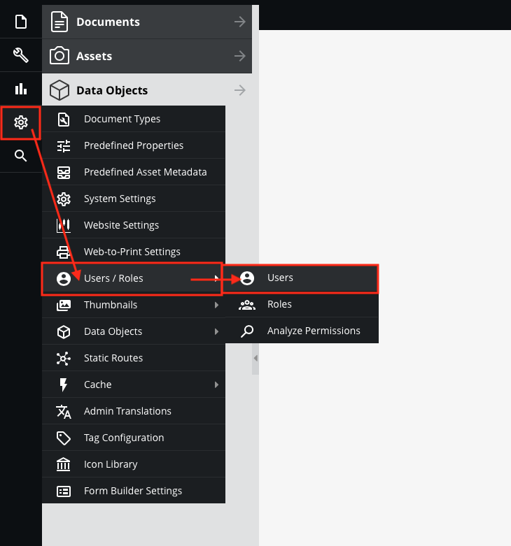
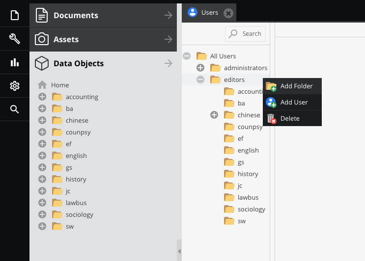
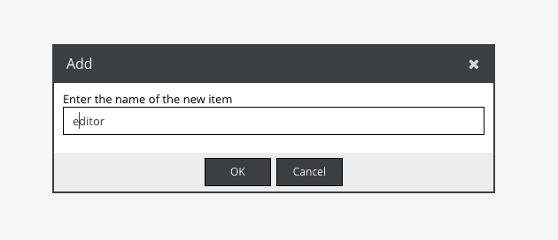
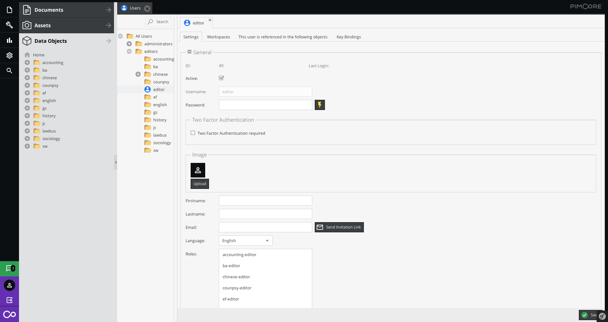
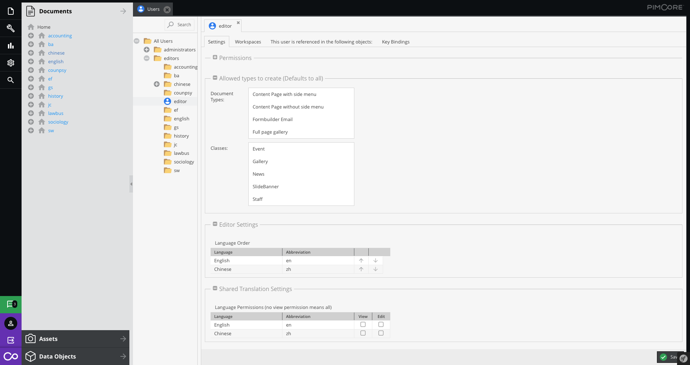
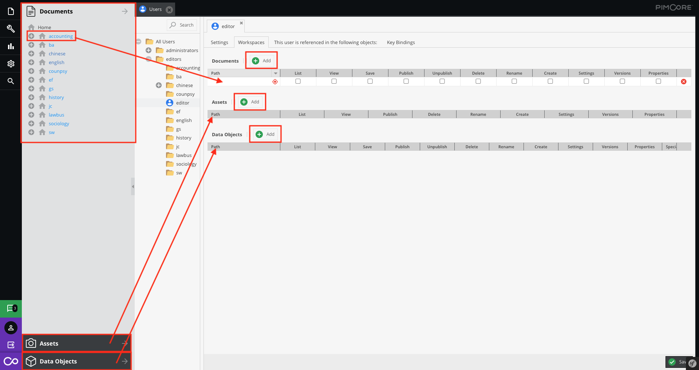
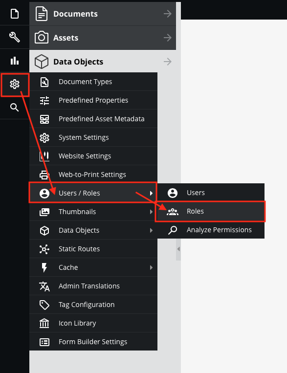
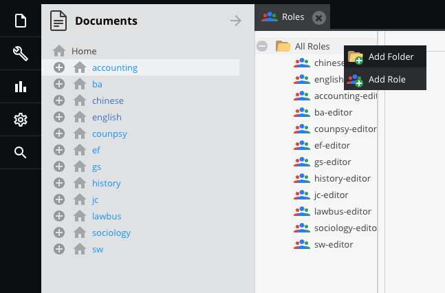
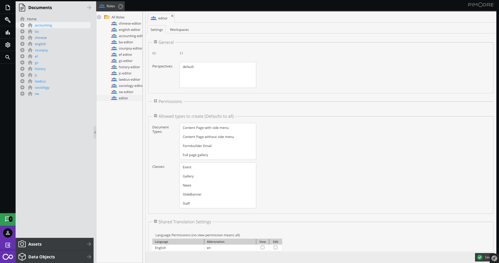
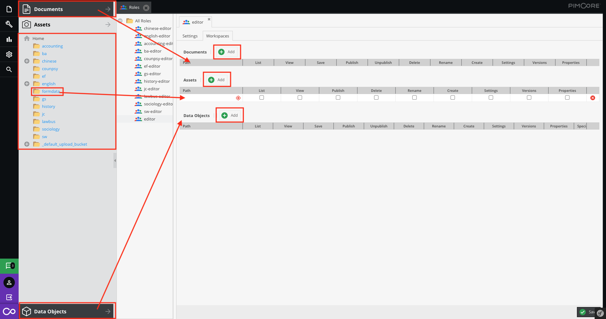

# Users and Roles

User permissions in Pimcore are based on a users and roles concept. Each user can have serveral roles and both - users and roles - can have permissions.

## Create a new user
```
Note: Can't restore when deleted the user.
```

Users is configured in Pimcore backend UI at `Settings` > `Users & Roles` > `Users and Settings` > `Users & Roles` > `User`.



Right click on the user list, select `add User`  
(You also can create a folder to a group them.)




> Be careful: It is your login username and it can not change the name of the user.




```
Note: Anything changed, please click the save button!
```




* **Active**  

Default is active. If inactive, this account can't log in.

* **Password**  

Default is unset. The user can't login. So, please set it when use the user.

* **Role**  

You can select the global role setting.  

> To create a global role setting, please go to [`Create a new role`](#create-a-new-role)

* **Allowed types of create**  

> To know more right click operation, please [click here](basic/interface?id=panel-tree)

* **Shared Translation Settings**  

> To know more shared translation, please [click here](basic/translation)


This is a specific user role/permission setting. Follow the step below:  

1. Add the field  
2. Drag the directory from the panel tree and enter to the accordingly the box.  
(Also, you can set the multiple directory.)



Sometime, you may have many users with the same role. You can set the global role setting.

> To create a global role setting, please go to [`Create a new role`](#create-a-new-role)

## Create a new role
```
Note: Can't restore when deleted the role.
```

Roles is configured in Pimcore backend UI at `Settings` > `Users & Roles` > `Users and Settings` > `Users & Roles` > `Roles`.



Right click on the role list, select `add role` and enter the name.   
(You also can create a folder to a group them.)



This is a global user role/permission setting.



Follow the step below:  

1. Add the field  
2. Drag the directory from the panel tree and enter to the accordingly the box.  
(Also, you can set the multiple directory.)



```
Note: Anything changed, please click the save button!
```