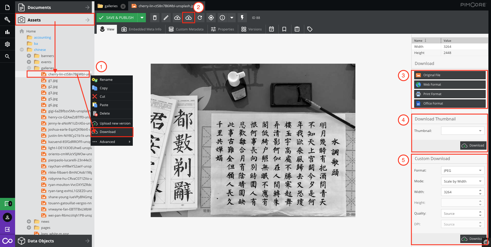
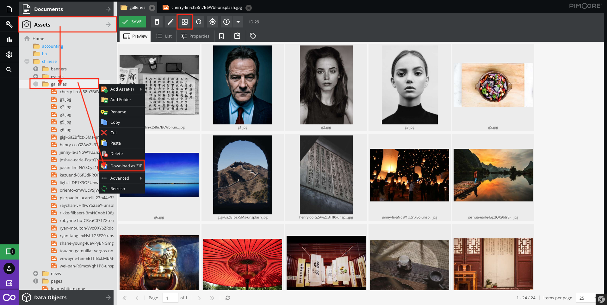

# Download assets

## Single asset

There are lots of ways to download a single asset.

1. **On Panel Tree**  
Right click on the panel tree.

2. **On Toolbar**  
Click the download button.

These are for image asset only: 

3. **Property panel(Download)**  
Depend on your production. Select a appropriate format.

4. **Property panel(Download Thumbnail)**  
Select a pre-defined thumbnail setting.  
(Not every site has predefined thumbnail setting) 

5. **Property panel(Custom Download)**  
Download asset with custom setting.

## Multi assets

It can download the multi-files as a zip file.

Right click `Assets` > `Your directory`, then select `Download as ZIP`

or

Open the asset folder and click the download button on toolbar.

> For further information, please [click here](assets/batch-process)