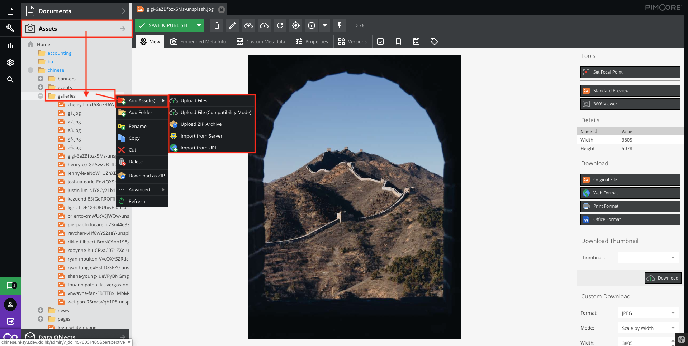

# Upload assets

Right Click and select `Add Asset(s)`

* **Upload Files**  
Upload multi assets

* **Upload File(Compatibility Mode)**  
Upload one asset

* **Upload ZIP Archive**  
Upload a zip file and it will extract automatically

* **Import from Server**  
Catch the assets from the website root

* **Import from URL**  
Use the URL to catch outsource

