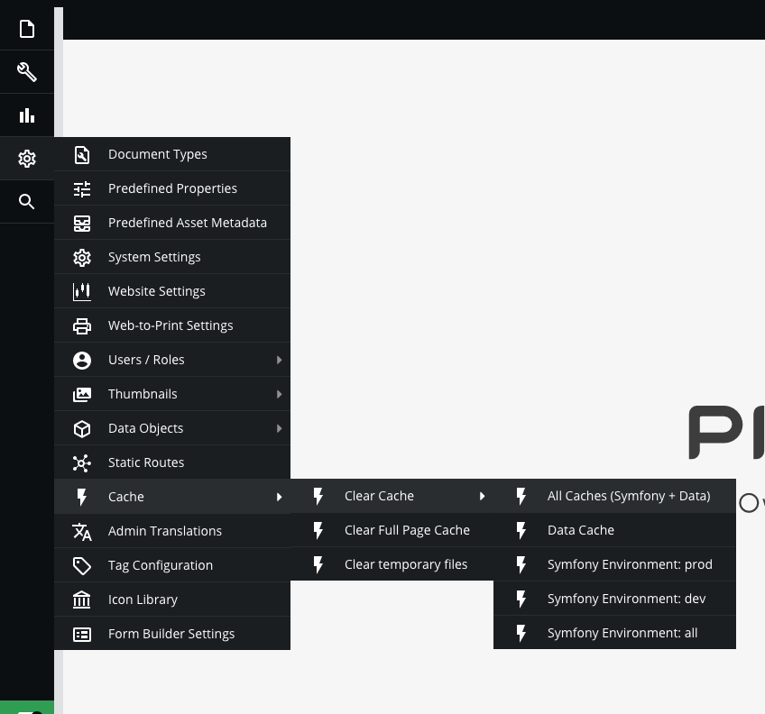

# Cache Management

Pimcore uses extensively caches for differently types of data. The primary cache is a pure object cache where every element (document, asset, object) in Pimcore is cached as it is (serialized objects). Every cache item is tagged with dependencies so the system is able to evict dependent objects if a referenced object changes.

Everytime clear cache, the system/website will be slow at  first time.

**Here is the guideline:**

* **For Symfony program**  
`Clear Cache` > `All Caches(Symfony + Data)` is a program(Symfony) output cache.

* **For pages**  
`Clear Full Page Cache` is the output cache, which you can use either as pure page cache (configurable in system settings), or as in-template cache.

* **For data, thumbnails, assets**  
`Clear temporary files` is used for add-ons like the glossary, translations, database schemes, and so on. The behavior of the caches is controlled by the add-on itself.

