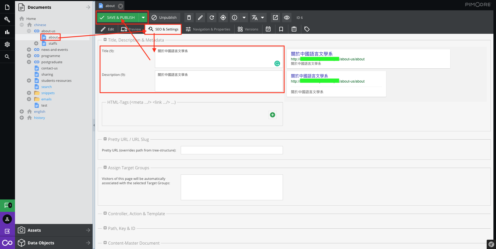
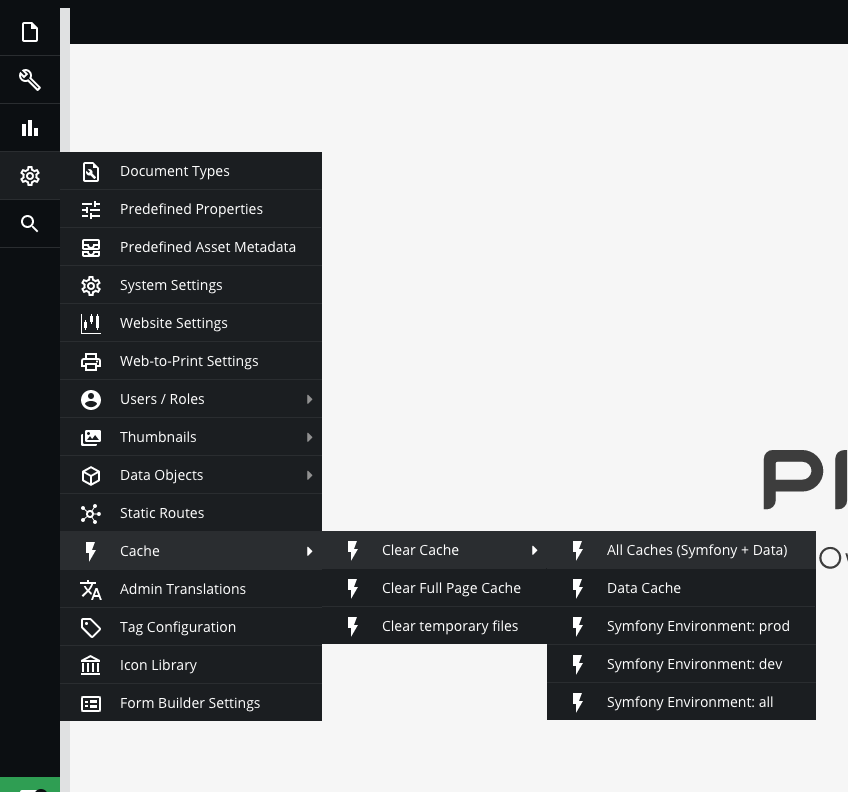
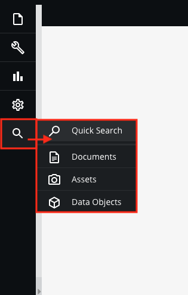

# Interface of the CMS 

4 sections in the area of the interface.  
There are [Sidebar](#sidebar), [Panel Tree](#panel-tree), [Toolbar](#toolbar) , [Tabbar](#tabbar).

  

Introducing most commonly feature in each of these areas.

## Sidebar

There are six areas that you use commonly in sidebar.
(File, Tools, Marketing, Settings, Search, Logout)

### Quick Open Document / Asset / Data Object

The editor can enter the file’s ID or the path (also full path) to open the file(Document / Assets / URL).

|  	|  	|
|:-------------------:	|:-------------------:	|

> How to find the file’s ID, please [click here](#LINK_TO)  

> To search by keywords, please [click here](#search)

### Translation

If your website supports multi-languages, Pimcore provides an easy way for editors to edit commonly used translation terms across the application, such as non-article,  which can be found here:  

`Tools` > `Translations` > `Shared Translations`.

(Available languages are defined within the system languages)

> How to translate the article, please [click here](data-objects)

### Recycle bin

All the files were sent to recycle bin when they were deleted.

> How to detele the file, please [click here](#LINK_TO)  

> For more information on operation in recycle bin, please [click here](basic/recycle-bin)

### Search Engine Optimization

SEO stands for "Search Engine Optimization". It repetitive process used to send signals to search engines that your website is worth being listed in Google's index.

The editor can make further SEO relevant settings for each Pimcore document. 

Two places that the editor can make SEO setting:

- **For Global Pimcore Document in the sidebar**  
`Tools` > `Search Engine Optimiztion` > `SEO Document Editor`

Double click the document.

Edit the "Title" and "Description" and click the "Save" button

- **For Each Pimcore Ddocument in the panel tree**   
`Open the desired document` > `navigate to the "SEO & Settings" tab`

At the top of this tab is the "Title & Description" section. Title and description must always be filled in, whereby HTML tags are to be regarded as optional. The title describes the page in one or a few words and the description summarizes the content of the page briefly and concisely. The title should not exceed a character length of 60 characters and the character length of the description should not pass the mark 170.

**About Pretty URL** 

The Pretty URL setting overrides a document's full path only for the purpose of routing. This is useful for when you would like to create shorter paths or friendly URLs for sharing. A Pretty URL does not redirect to the original URL.

Here is example.  
Original URL: https://demo.com/about/our-story/aticle/123

Fill the "our-story-123" in pretty url field.

Pretty URL: https://demo.com/our-story-123

### Cache

Pimcore uses extensively caches for differently types of data. The primary cache is a pure object cache where every element (document, asset, object) in Pimcore is cached as it is (serialized objects). Every cache item is tagged with dependencies so the system is able to evict dependent objects if a referenced object changes.

> For more information on operation in cache section, please [click here](basic/cache)

### Search

The editor can search by Quick Search (All) / Document / Assets / Data Object

Quick Search(All)

Search Document / Assets / Data Objects

> For more information on operation in search, please [click here](basic/search)

## Panel Tree

### Operation{docsify-ignore}
There are 3 sections which are [Documents](#_1-operation-of-documents), [Assets](#_2-operation-of-assets), [Data Objects](#_3-operation-of-data-objects)

Left Click: Open the tree or Open the file  
Right Click: Operation on this file

Here is the highlighting those most commonly operation. Please browse the relative section for any further information.

### 1. Operation of Documents

| 
Functions
                                         	| Descriptions                                                                                                                                                                                                                                	|
|---------------------------------------------------	|---------------------------------------------------------------------------------------------------------------------------------------------------------------------------------------------------------------------------------------------	|
|                             	| To change the name in the navigation and the title in the browser tab, you must open the document. In the [`SEO & Settings`](documents/settings) tab, you can adjust the title in the browser tab. Switch to the [`Navigation & Properties`](documents/properties) tab to change the name in the navigation. 	|
|    	| Publish:  Everyone can access this file or link in any mode.  Unpublish:  Only the website holder can access this file or link in preview mode.                                                                                 	|

> For more information of Documents, please [click here](documents/)  

### 2. Operation of Assets

In assets of the panel tree, there are function lists depends on the item.

Right Click on the folder

Right Click on the asset  

| Functions                                         	| Descriptions                                                                               	|
|---------------------------------------------------	|--------------------------------------------------------------------------------------------	|
|                             	| The file path will be changed*                                                              	|
|    	| On the folder:  Download the whole directory  On the asset: Download this file 	|
|                             	| Replace the assets with same name and URL**                                                   	|

> Rename  
* If the file is dragged on the document / Data object, Pimcore can update the file path automatically.  
* If the file is just copied the path (Hardcoded) on the document / Data object or share the URL, Pimcore does not redirect this file with the new name.

> Upload new version  
* Sometime the file is kept in cache, please [click here](#cache) to know about how to clear cache

> For more information of Assets, please [click here](assets/)  

### 3. Operation of Data Objects

>   
* Make sure the type of data object in the directory which is created by non-system(Editor, Administrator, Website holder...) or allow to edit it before renaming it.  
* Most of the cases, do not rename the folder. The reason is some components or programs are depending on the folder name.

> For more information of Data Objects, please [click here](data-objects/)  

## Toolbar

There are highlight features in the Toolbar.

## Tabbar

There are highlight features in the Tabbar.