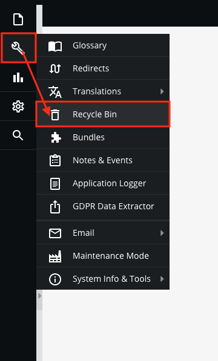
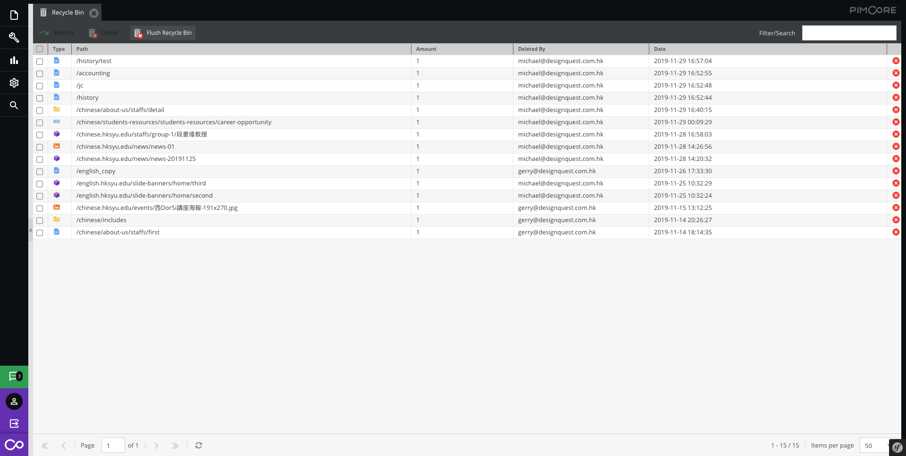
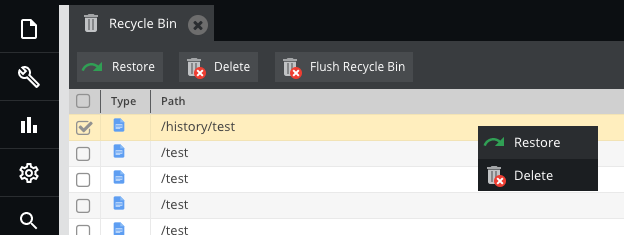

# Recycle Bin

All the files were sent to `Tools` > `Recycle Bin` when they were deleted.

The editor can select the toolbar or right-click to further operation

| Functions             	| Descriptions                       	|
|-----------------------	|------------------------------------	|
|  	| Restore to original location       	|
|  	| Permanently delete(Selected Items) 	|
|  	| Permanently delete(All)            	|

> How to detele the file, please [click here](basic/interface) (Panel tree or Toolbar)
