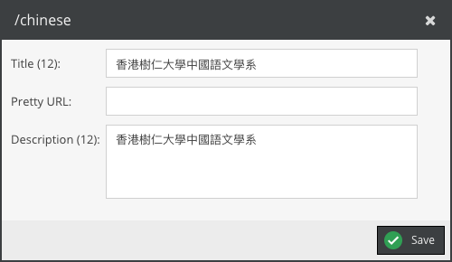

## Global Search Engine Optimization

SEO stands for "Search Engine Optimization". It repetitive process used to send signals to search engines that your website is worth being listed in Google's index.

Two places that the editor can make SEO setting:

- **For Global Pimcore Document in the sidebar**  
`Tools` > `Search Engine Optimiztion` > `SEO Document Editor`

Double click the document.

Edit the "Title" and "Description" and click the "Save" button

- **For Each Pimcore Ddocument in the panel tree**   
`Open the desired document` > `navigate to the "SEO & Settings" tab`

At the top of this tab is the "Title & Description" section. Title and description must always be filled in, whereby HTML tags are to be regarded as optional. The title describes the page in one or a few words and the description summarizes the content of the page briefly and concisely. The title should not exceed a character length of 60 characters and the character length of the description should not pass the mark 170.

## Pretty URL

The Pretty URL setting overrides a document's full path only for the purpose of routing. This is useful for when you would like to create shorter paths or friendly URLs for sharing. A Pretty URL does not redirect to the original URL.

Here is example.  
Original URL: https://demo.com/about/our-story/aticle/123

Fill the "our-story-123" in pretty url field.

Pretty URL: https://demo.com/our-story-123

The editor can set it in the same places of the above instruction.