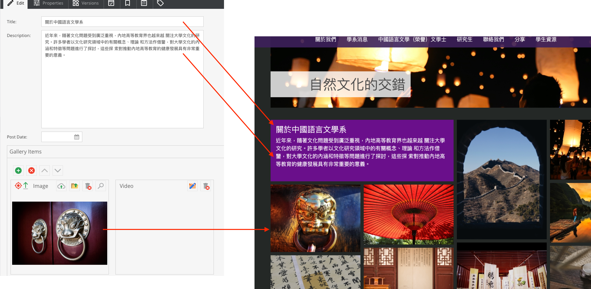

# Gallery

## Create a new gallery

If this is a new gallery, please create. Otherwise, edit the existing gallery (data object).

Go to `Data Objects` > `Your directory` > `galleries` , then right click ` Add Object` > `Gallery`

 
Please read and follow the Guide below, then fill up the form.

## Add more images/video

## Further operation
The further operation is similar to the `SliderBanner` data object, please [click here](data-objects/slidebanner)