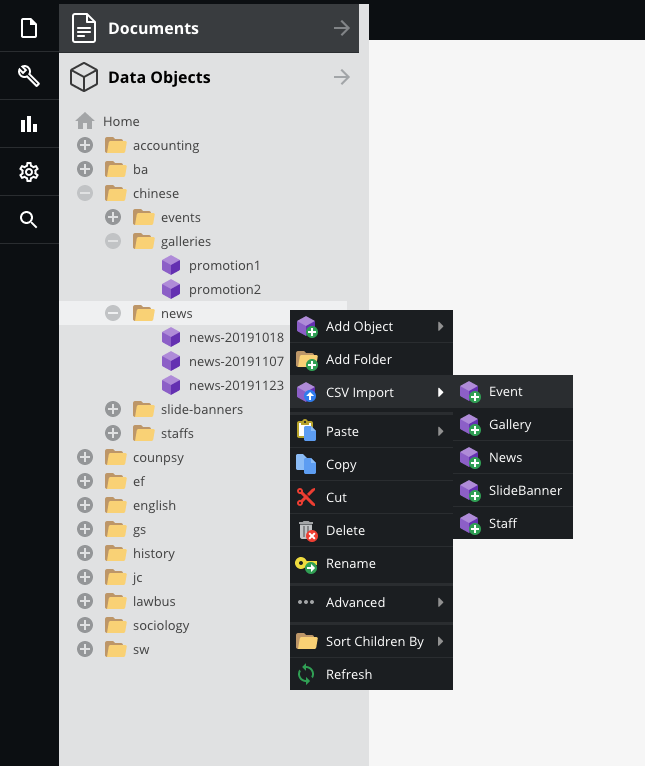
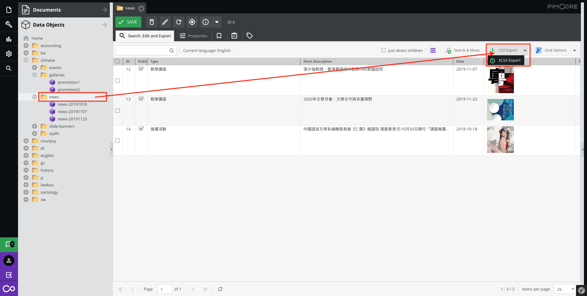

# Import and Export Data Objects

## Import Data Objects

The editor can use CSV Import to process a batch data.

Right click on the target folder and select type of CSV Import.

Then, upload a modified CSV file.

> Get the CSV file demo/template, please [click here](#export-data-objects) (Export Data Objects)

## Export Data Objects

In Data Objects, select folder then click `CSV Export`

The editor also can filter the table then export it.