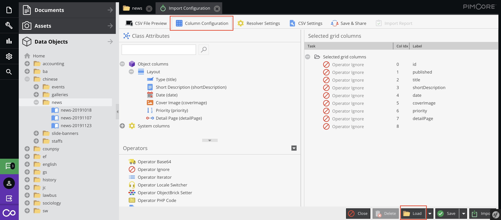
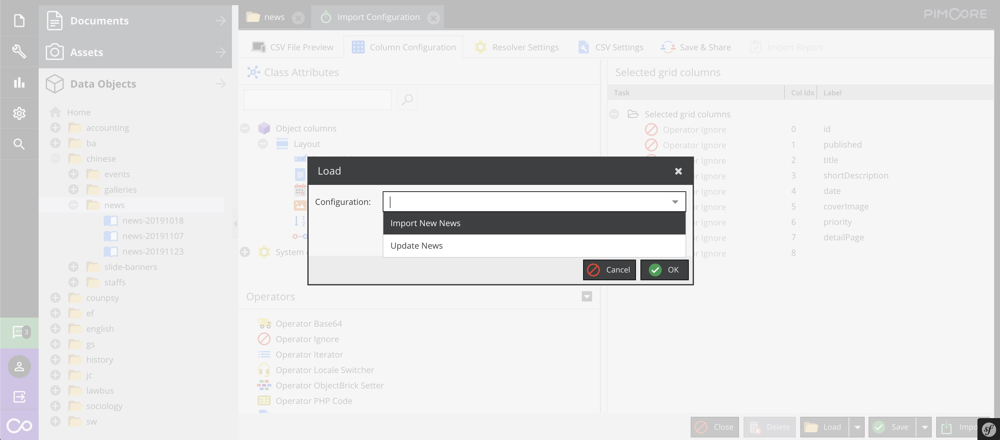
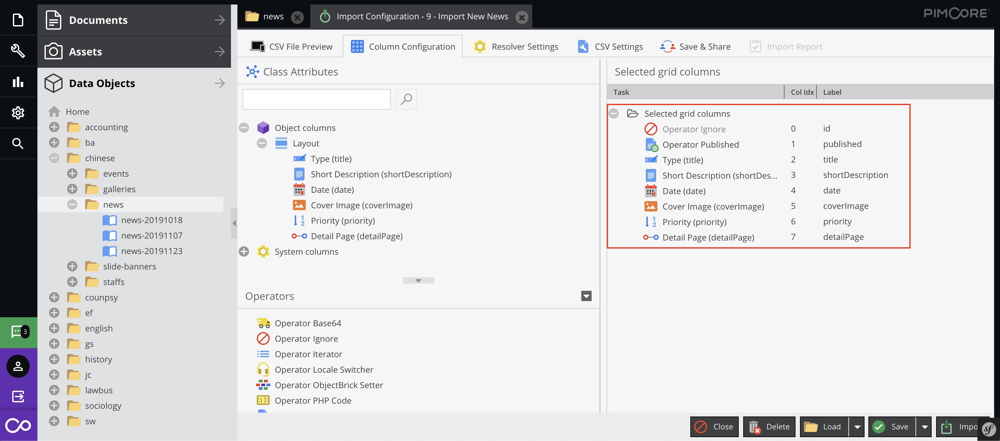

# Import and Export Data Objects

## Export Data Objects

In Data Objects, select folder then click `CSV Export`

The editor also can filter the table then export it.

## Import Data Objects

The editor can use CSV Import to process a batch data.

1. Right click on the target folder and select type of CSV Import.

2. Upload a modified CSV file

> You may export the data objects to get the CSV file template

3. When a Import Configuration window opened, click the "Column Configuration" tab, then click the "Load" button on page bottom

4. If you import new objects, plaese select the "Import New xxx". If you import modified objects, please select "Update xxx"

1. If the import data match the object fields, the result should similar to the picture below, then click "Import" in the page bottom to complete the import.

