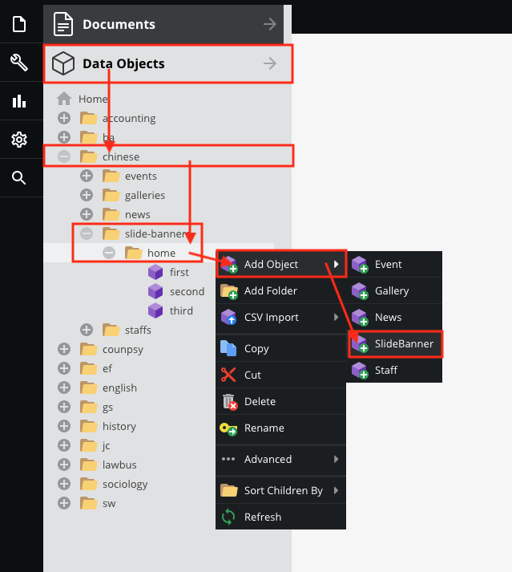
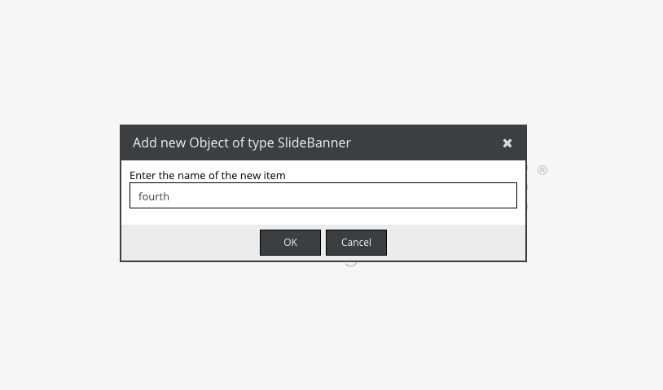
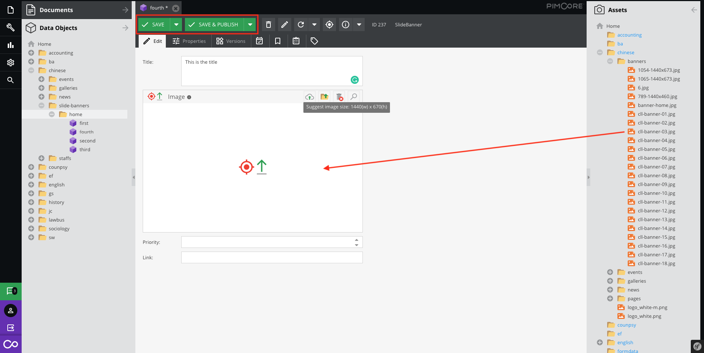
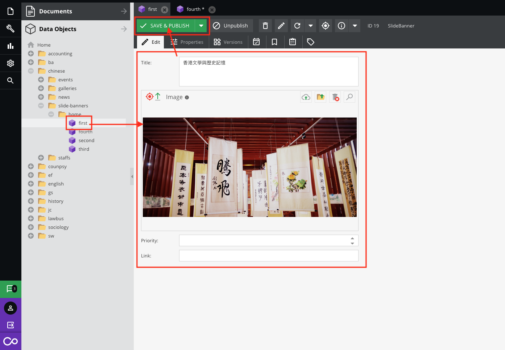
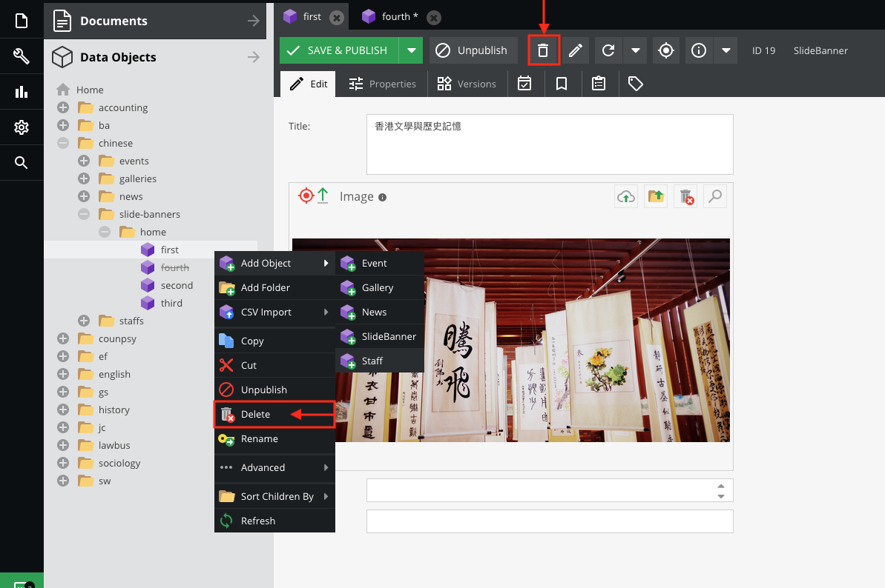
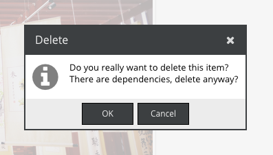
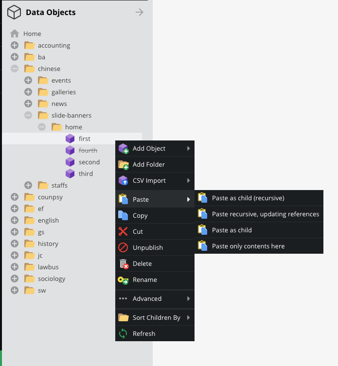

# SlideBanner

## Create a new slide banner

Go to `Data Objects` > `Your directory` > `slide-banner` > `home` , then right click ` Add Object` > `SlideBanner`

Please enter the any key name(No duplicate)

* **Title**  
Suggest a short title. 

* **Image**  
Drag the specific size image from the Assets. 

> To know more about upload assets, please [click here](assets/).

* **Sequence**  
The slide order depends on the created date. The editor can enter the value number in the priority field to move to the front of this slide banner.

* **Link**  
Please enter the absolute path (http://...)

Then, Click the `Save & Publish`.

> To know more about saving options, please [click here](basic/interface#saving-options).

## Edit the slide banner

1. Select the data object
2. Modify the fields
3. Then, click the `Save` button

> To know more about saving options, please [click here](basic/interface#saving-options).

## Delete the slide banner

Open the data object and click the `Delete` button

or 

Right click on the data object and select the `Delete`

Click `OK` to delete

> Restore the data object, please [click here](basic/recycle-bin)

## Duplicate the slide banner

1. Right click on the target item
2. Select `Copy`
3. Right click on the target parent directory
4. Select `Paste` > `Paste as child`

**Paste**  
* `Paste as child`(target item only)  
* `Paste as child(recursive)`(target item and child items)

## Unpublish the slide banner

Open the data object and click the `Unpublish` button

or 

Right click on the data object and select the `Unpublish`

After that, it looks like the `fourth` data object with a strikethrough.

## Rollback the slide banner

> Please [click here](basic/versioning) to browse the versioning section.

## Schedule the slide banner

> Please [click here](basic/scheduling) to browse the scheduling section.