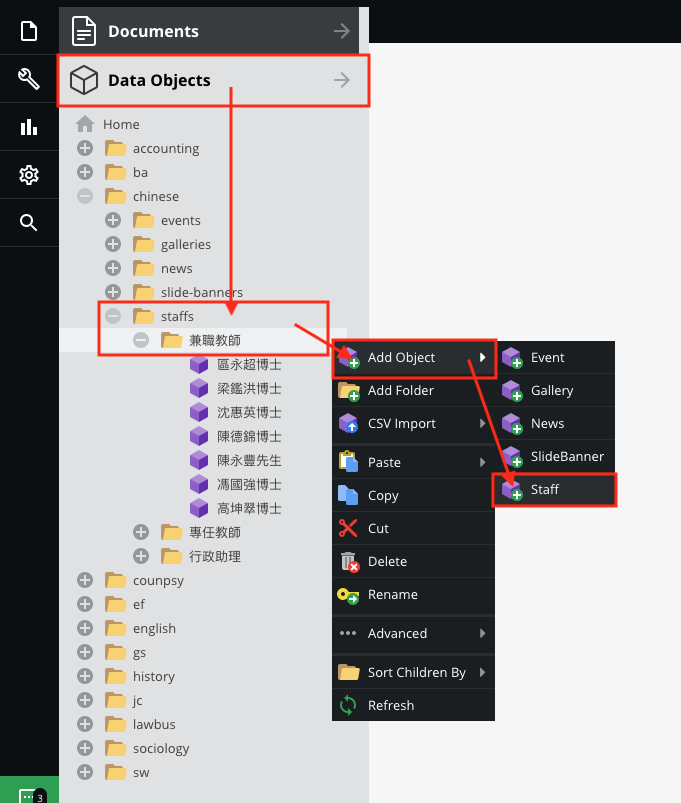
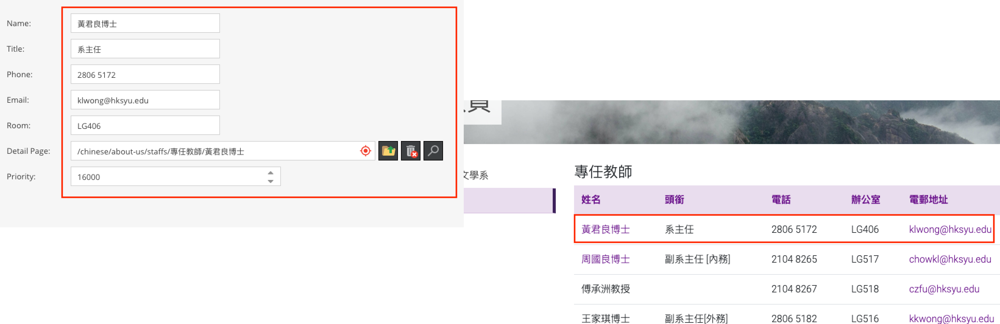

# Staffs

## Create a new staff

Go to `Data Objects` > `Your directory` > `Staff` , then right click ` Add Object` > `Staff`

Please read and follow the Guide below, then fill up the form.

* **Priority**  
The order numbers from greatest to least.

> To create detail page, please [click here](documents/tree-menu?id=add-page)

## Further operation
The further operation is similar to the `SliderBanner` data object, please [click here](data-objects/slidebanner)