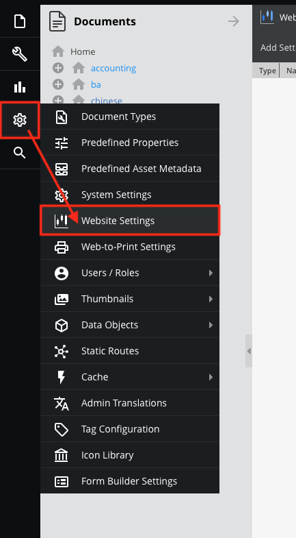
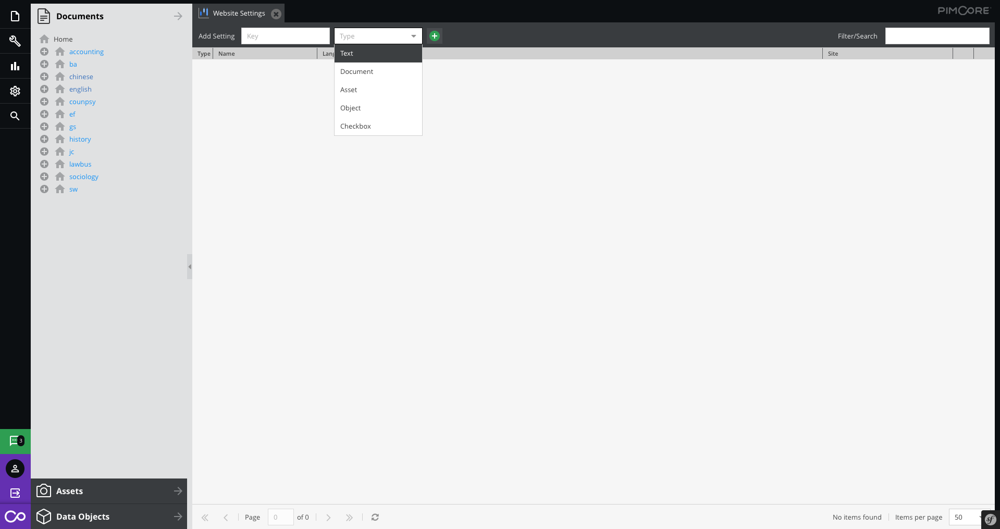
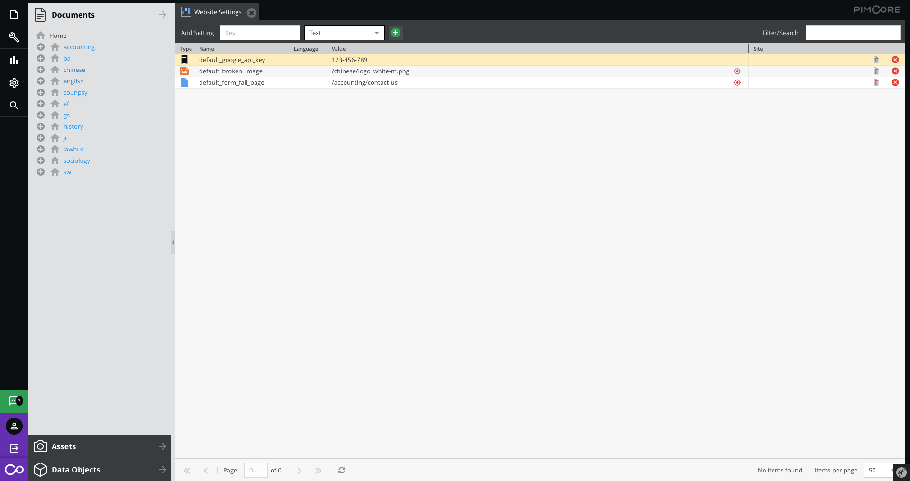

# Website Managements

The Website Settings give you the possibility to configure website-specific settings, which you can access in every controller and view.

Examples:

 - ReCAPTCHA public & private key
 - Locale settings
 - Google Maps API key
 - Defaults ....

You can set any type of value for the global website.

Most of the cases, our programmer set to you. You may need to update the value only. Such as changing the API key etc...

 Example:
