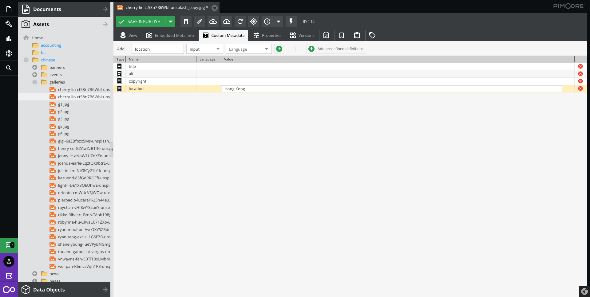

# Custom metadata

Use the **alt** attribute to supply an alternative description of the element. The text you use for the alt attribute is shown to a visitor when their browser doesn’t display the element itself. Often it’s shown in the space where an image would normally appear.

Use the **title** attribute to provide additional information about the element. The text you use for the title attribute is shown to a visitor as well as the element itself. Most browsers display title text in a yellow tool tip that appears when you hover your mouse over the element. Some, though, display the title text in the status bar.

Use the **copyright** attribute to mention who belongs to.

Also, it can add more information that your website supported.

