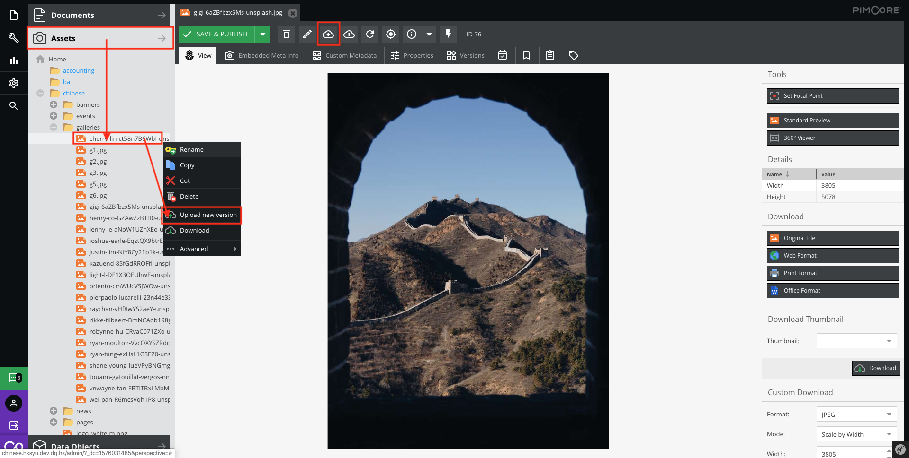
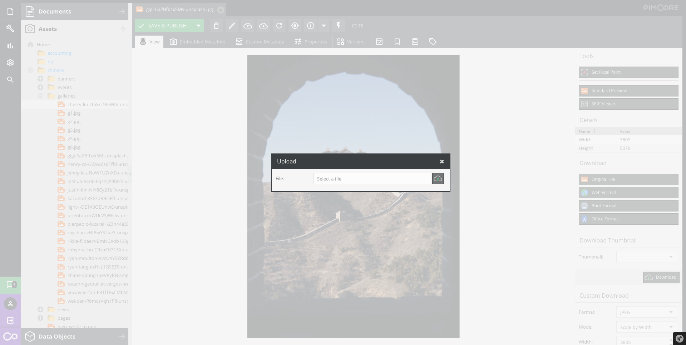

# Replace asset

Right click on panel tress `Assets` > `Your directory` > `Your asset`, then select `Upload new version`

or

Open the asset and click upload new version on the toolbar

Tt will pop up an upload file message box.

The uploaded file will be replaced immediately!

> Want to Rollback? Please [click here](basic/versioning)