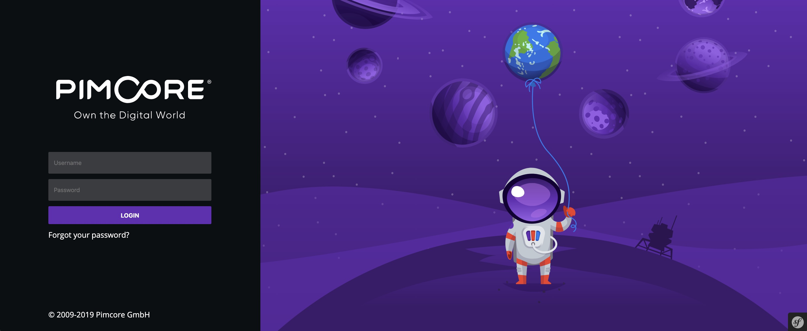

# Getting Start 

## About the Pimcore CMS

This CMS was developed by [Design Quest Limited](https://designquest.com.hk) based on the [Pimcore](https://pimcore.com/) open source content management system (v6.x).

Please note that this documents only include instructions that are directly related to the HKSYU websites management. If you want to know more in-depth systems and operations of the Pimcore, you can refer to the official Pimcore [documents](https://pimcore.com/docs/6.x/Development_Documentation/).

---
## The major sections of CMS

Pimcore divides the contents to be managed into 3 major sections: [**Documents**](documents/), [**Assets**](assets/) and [**Data Objects**](data-objects/).

| Subjects                      | Descriptions                                                                   |
| ----------------------------- | ------------------------------------------------------------------------------ |
| [Documents](documents/)       | Use documents to manage the web pages and the navigation menus                 |
| [Assets](assets/)             | Use assets to manage images and downloadable files (e.g. PDF, ZIP files etcs) |
| [Data Objects](data-objects/) | Use data object to manage the structured data (e.g. news, events, staffs etc.) |

## The CMS Interface

[Introduction to the CMS interface](interface.md)

## Assistant features
In addition to the above three major sections, here are some features to help you manage your website more conveniently.

| Subjects                            | Descriptions                                               |
| ----------------------------------- | ---------------------------------------------------------- |
| [Login](login.md)             | Login to the CMS                                           |
| [Search](search.md)           | How to find contents in the CMS?                           |
| [Versioning](versioning.md)   | How to rollback the modification?                          |
| [Scheduling](scheduling.md)   | How to publish/unpublish the contents?                     |
| [Recycle Bin](recycle-bin.md) | How to recover deleted files?                              |
| [Cache](cache.md)             | How to clear server side cache to update website contents? |
| [Search Engine Optimization](search-engine-optimization)| How to declare or define the website for search engine? |
| [Translation](translation.md) | How to update the interface text in multi-language? |