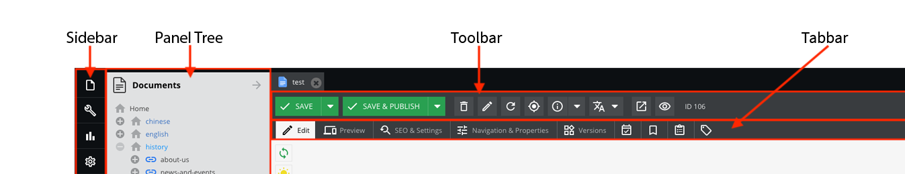
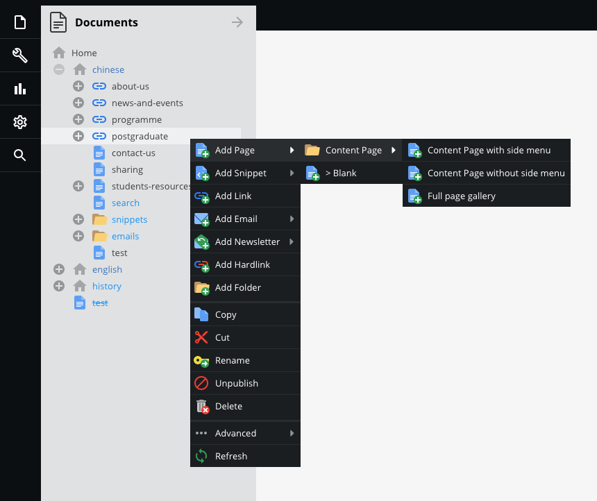
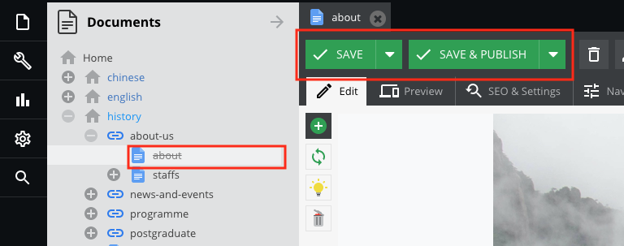
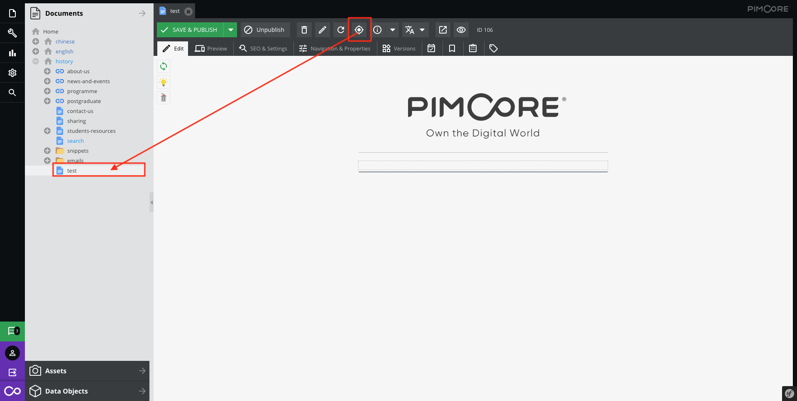
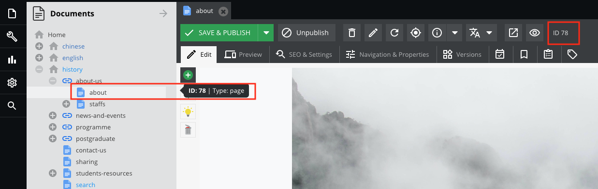

# Interface of the CMS 

4 sections in the area of the interface.  
There are [Sidebar](#sidebar), [Panel Tree](#panel-tree), [Toolbar](#toolbar) , [Tabbar](#tabbar).

  

Introducing most commonly feature in each of these areas.

---
## Sidebar

There are six areas that you use commonly in sidebar.
(File, Tools, Marketing, Settings, Search, Logout)

---
## Panel Tree

### Operation{docsify-ignore}
There are 3 sections which are [Documents](#operation-of-documents), [Assets](#operation-of-assets), [Data Objects](#operation-of-data-objects)

Left Click: Open the tree or Open the file  
Right Click: Operation on this file

Here is the highlighting those most commonly operation. Please browse the relative section for any further information.

### Operation of Documents

| 
Functions
                                         	| Descriptions                                                                                                                                                                                                                                	|
|---------------------------------------------------	|---------------------------------------------------------------------------------------------------------------------------------------------------------------------------------------------------------------------------------------------	|
|                             	| To change the name in the navigation and the title in the browser tab, you must open the document. In the [`SEO & Settings`](documents/settings) tab, you can adjust the title in the browser tab. Switch to the [`Navigation & Properties`](documents/properties) tab to change the name in the navigation. 	|
|    	| Publish:  Everyone can access this file or link in any mode.  Unpublish:  Only the website holder can access this file or link in preview mode.                                                                                 	|

> For more information of Documents, please [click here](documents/)  

### Operation of Assets

In assets of the panel tree, there are function lists depends on the item.

Right Click on the folder

Right Click on the asset  

| Functions                                         	| Descriptions                                                                               	|
|---------------------------------------------------	|--------------------------------------------------------------------------------------------	|
|                             	| The file path will be changed*                                                              	|
|    	| On the folder:  Download the whole directory  On the asset: Download this file 	|
|                             	| Replace the assets with same name and URL**                                                   	|

> Rename  
* If the file is dragged on the document / Data object, Pimcore can update the file path automatically.  
* If the file is just copied the path (Hardcoded) on the document / Data object or share the URL, Pimcore does not redirect this file with the new name.

> Upload new version  
* Sometime the file is kept in cache, please [click here](basic/cache) to know about how to clear cache
* Want to Rollback? Please [click here](basic/versioning)

> For more information of Assets, please [click here](assets/)  

### Operation of Data Objects

>   
* Make sure the type of data object in the directory which is created by non-system(Editor, Administrator, Website holder...) or allow to edit it before renaming it.  
* Most of the cases, do not rename the folder. The reason is some components or programs are depending on the folder name.

> For more information of Data Objects, please [click here](data-objects/)  

---
## Toolbar
| Functions              	| Descriptions                                                                                                                        	|
|------------------------	|-------------------------------------------------------------------------------------------------------------------------------------	|
|    	| It can access publicly.                                                                                                             	|
|  	| Only store the data.                                                                                                                	|
|    	| It can access in preview mode only.                                                                                                 	|
|    	| Remove it. [Click here](basic/recycle-bin)                                                                                               	|
|    	| Rename it. [Click here](#operation)                                                                                                 	|
|    	| Reload it. Sometimes, there are multi-editor modify in the same file. It can get the latest version when it saved by the partner 	|
|    	| Jump to the panel tree. [Click here](#show-in-tree)                                                                                 	|
|    	| Access via Public Mode                                                                                                              	|
|    	| Access via Preview Mode                                                                                                             	|

If the file changed to unpublish, 
the file name will be strikethrough in the panel tree and provided the `Save` button in the toolbar.

### Saving options
* `Save, publish` saved all data including edit property, version, schedule, etc... 

* `Save, publish and close` same `Save, publish` and close the tab

* `Only save new version` saved only version

* `Save only scheduled tasks` saved only schedule

### Show in Tree

Open and locate it into the panel tree after clicking it.

### Get the file's ID

Every Document / Asset / Data Object has its own ID.

The editor can hover the file and it shows the ID and the type.  
or  
It shows on the toolbar.

---
## Tabbar

The tabbar is depend on the file type.

> For more information of Documents, please [click here](documents/)  

> For more information of Assets, please [click here](assets/)  

> For more information of Data Objects, please [click here](data-objects/)  