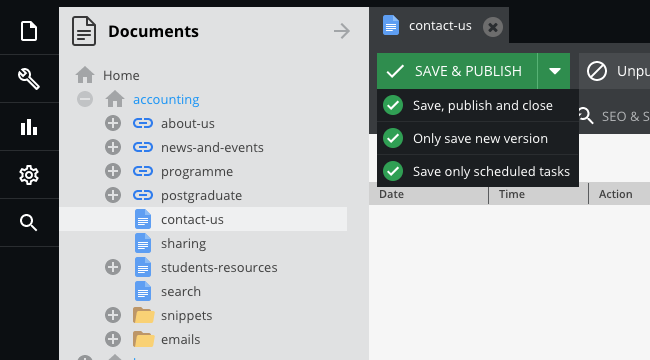

# Scheduling

Scheduling is provided an advantage of on-time changing.

Every element type in Pimcore (documents, objects, assets) has implemented a scheduler which provides the ability to create tasks like:

* Publish
* Unpublish
* Delete
* Publish version (You can read more about [Versions](basic/versioning) in the Versioning section)

Open the file (documents, objects, assets) in panel tree, then select `Schedule` tab.

The editor can add or delete the schedule in table view.  
If the `Active` is unchecked, the schedule will not be implemented.

Save schedule.

**About Saving**
> For more information of saving option, please [click here](basic/interface?id=saving-options)  
