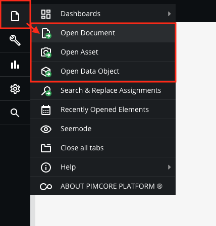
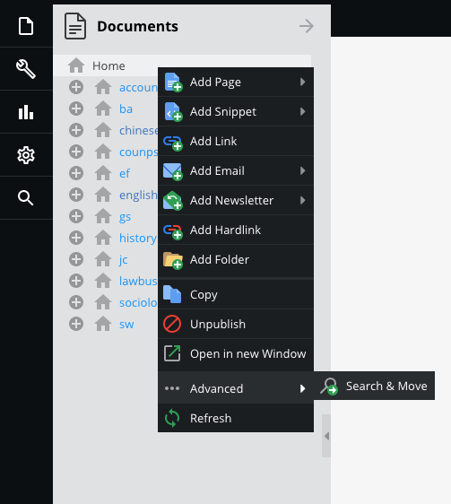
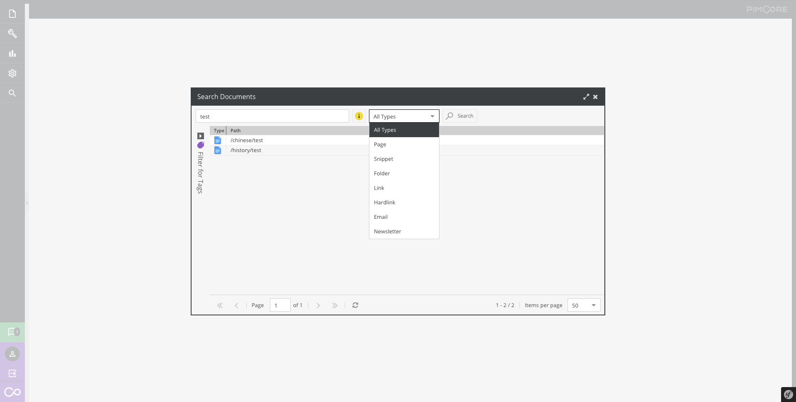

# Search

The editor can enter the file’s ID or the path (also full path) to open the file(Document / Assets / URL).

There are two ways to open search popup.
* [Search by ID/PATH/URL](#search-by-idpathurl)
* [Search by Keywords](#search-by-keywords)

## Search by ID/PATH/URL

`Files` > ` Open Document / Asset / Data Object`

Enter ID / Path / URL to search

|  	|  	|
|:-------------------:	|:-------------------:	|

> How to find the file’s ID, please [click here](basic/interface#get-the-file39s-id)  

## Search by Keywords

Right click on the panel bar

or 

`Search` > `Quick Search` (All) / `Document` / `Assets` / `Data Object`

Quick Search(All)

Search Document / Assets / Data Objects

