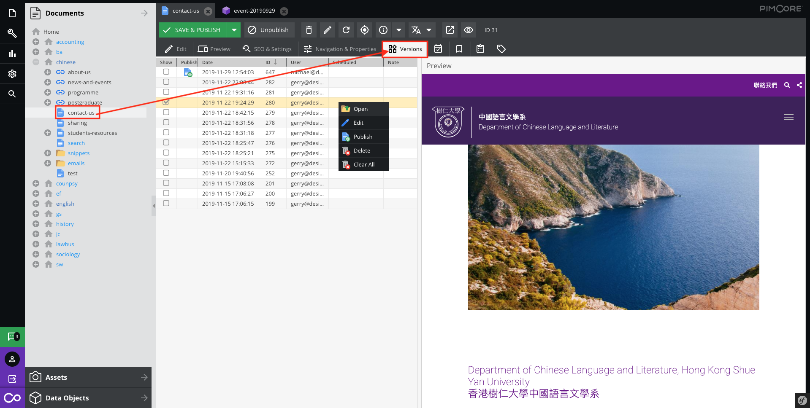

# Versioning

Versioning is provided the advantages which are rollback changing and trace user editing.

All contents in Pimcore (documents, assets and objects) are versioned. You can have as many versions as you want. On each change a new version of the element is created.

Open the file (documents, objects, assets) in panel tree, then select `Versions` tab.

## Preview and operate version 

* **Preview**  
Check it on the list and it shows on the Preview.  
This Preview just shows the content of version.

Further operation, please right click on the item of list.

> For more information of saving options, please [click here](basic/interface#saving-options) 

## Rollback

Right click and select `Publish`.

The publich icon will display on the field.

## Tracing version

The table list shows 
* who edit 
* when edit 
* what is current version published

Also, 
* which schedule was used
* the mention in version

## With scheduling

After [save](basic/interface#saving-options) it, select the `schedule` in the tabbar.

> For more information of scheduling, please [click here](basic/scheduling) 