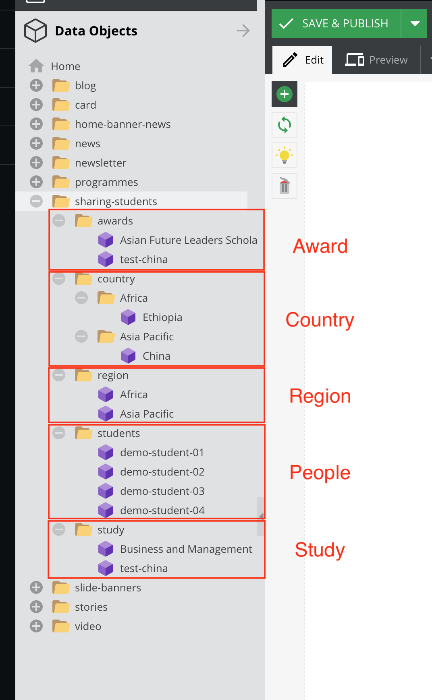

# Sharing Students

## Intro

To create a studnet object, there are 5 parts of the object you need to create/prepare:

These objects are related to these functions.

There are the folder structure of the Sharing Students.

## The creating steps.

You also need to create a [sharing students](documents/content-blocks?id=sharing-students) of a content block in the Documents.

In `sharing-students` folder,

1. Create a `Country` object in the country folder(Related region folder)
2. After created `Country` object, Create a `Region` object in the region folder
3. Create a `Study` object in the study folder
4. Create a `Award` object in the award folder
5. Create a `People` object in the students folder

> The name of folders and object are used for classification, so you can name any name you want.

> To know more about saving options, please [click here](basic/interface#saving-options).

## Create Region & Country

Right click on the folder and select `Region`

| Subjects       | Descriptions                                                  |
| -------------- | ------------------------------------------------------------- |
| Code           | For the filtering, give a uniqlo short name                   |
| RGB            | This is the overlay color of the image                        |
| Countries list | Drag the country which is releated region from country object |

Right click on the folder and select `Country`

We provide some flags icon in the assets panel. you can drag the icon to the image field.  
`Assets` > `country` > `flags`

## Create Study

Right click on the folder and select `Study`

The order numbers from greatest to least and shows in the filter.

## Create Award

Right click on the folder and select `Award`

The order numbers from greatest to least and shows in the filter.

## Create Student(People)

Right click on the folder and select `People`

| Subjects    | Descriptions                                                                               |
| ----------- | ------------------------------------------------------------------------------------------ |
| Avatar      | Drag the image from the assets panel                                                       |
| Name        | Name                                                                                       |
| Country     | Drag the `Country` Object (used for filter)                                                |
| Quote       | (Disable)                                                                                  |
| Education   | It is a text description of education                                                      |
| Award       | It is a text description of award                                                          |
| Work        | It is a text description of work                                                           |
| Study       | It is a text description of study                                                          |
| Awards      | Drag the `Award` object (used for filter)                                                  |
| Description | It is a text description.                                                                  |
| Link        | Open the link instead of popup module, you need to fill the link path or drag the document |
| Images      | Add multiple images and drag the image from the assets panel                               |
| Videos      | Add multiple videos and drag the video from the assets panel                               |

**Screenshot:**  
  
