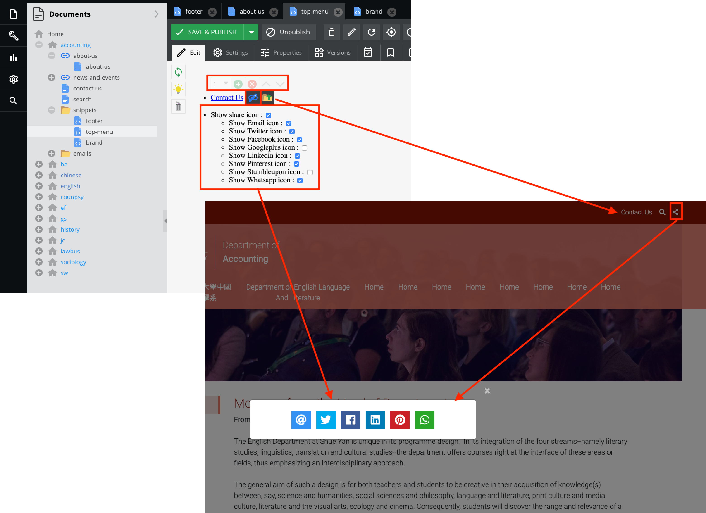

# Snippets


There are three parts of snippet which are `footer`, `top-menu` and `brand`.

* **footer**  
Change the footer such as footer logo, Find US, Contact US, Follow US, Copyright statement<br>  
<br>
We recommend 4 is the best number of columns and it provided 3 types of content for you to define each column.
There are `Image`, `Text with Title`, `Follow us`.<br>  


```
Note: Anything changed, please click the save button!
```

* **top-menu**  
Add/Remove the social sharing icon and add multiple links beside the search icon<br>  
<br>
About multiple link  
1. Click `Add` button, then click `Edit` button, the edit window pop up.  
2. Enter the title name of this link.  
3. Drag any pages / assets or type your link in the field
4. save the edit window and snippet page


```
Note: Anything changed, please click the save button!
```

* **brand**  
Change the header logo and sub placement<br>  
  
There is a `Logo (Mobile)` field which shows the best view in small screen and responsive.

```
Note: Anything changed, please click the save button!
```