# Email Templates 

## Create an email

On panel tree, Select the place that you want the create an email template.  
Right click and select `Add Email` > `Formbuilder Email`

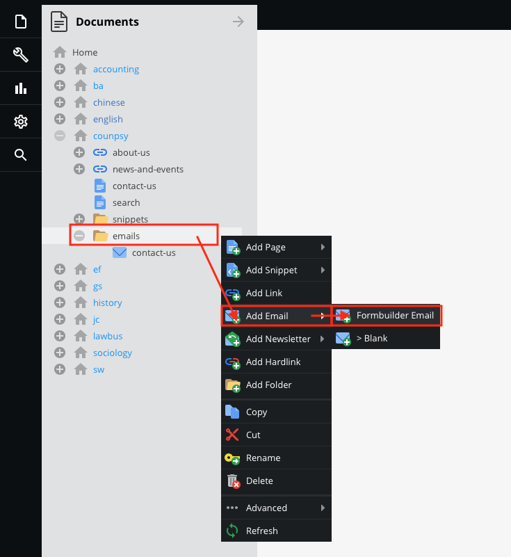

> To create/link a form, please [click here](forms/)

> For more information of Operation in Documents, please [click here](basic/interface)

## Edit an email

Open the email template, there is a ckeditor.  
Type any contents such as texts, images, parameters, HTML code, etc...

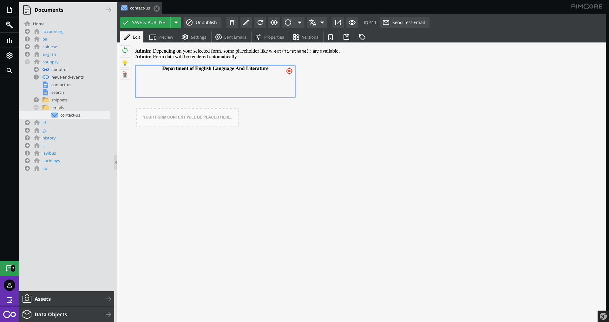

```
Note: Anything changed, please click the save button!
```

* **HTML code(For advanced user)**  
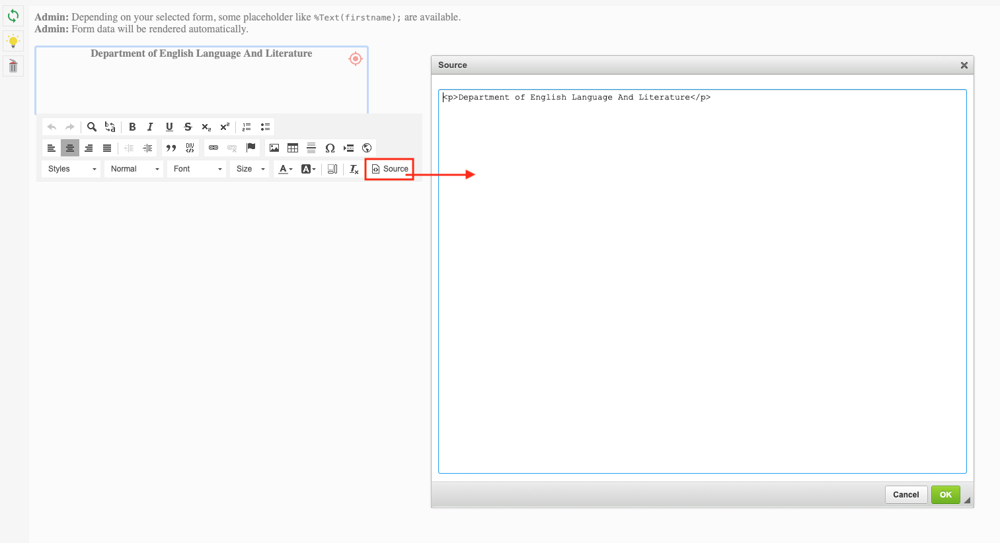
Among those email clients that do support HTML, some do not render it consistently with W3C specifications, and many HTML emails are not compliant either. Therefore, it leads to problems if the recipient's email client does not support it. In the worst case, the recipient will see the HTML code instead of the intended message.  
<br>To save HTML code, please click the `OK` button first then click the `Save` button on the toolbar.

* **Parameters**  
What are these parameters? , please [click here](#get-email-parameters)

## Preview email
The ways of preview:
- [Preview in the cms](#preview-in-the-cms)
- [Preview in the browser](#preview-in-the-browser)
- [Preview in the mail client](#preview-in-the-mail-client)

### Preview in the cms

Switch the `Edit` tab to `Preview`

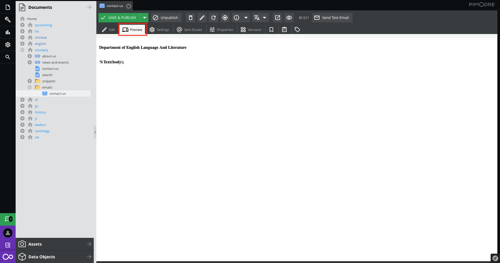

### Preview in the browser

Click the preview icon on the toolbar to `Access via Public Mode`/ `Access via Preview Mode`
> About the toolbar, please [click here(toolbar)](basic/interface?id=toolbar)


### Preview in the mail client

Click the `Send Test-email` icon on the toolbar, then it shows the sent form. Fill up the [parameters](#get-email-parameters) if you need.

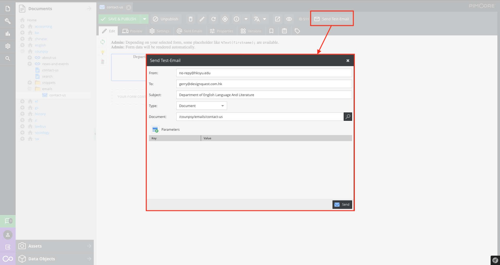

Then, click the `send` button and it shows the confirmation box. Select `Yes`

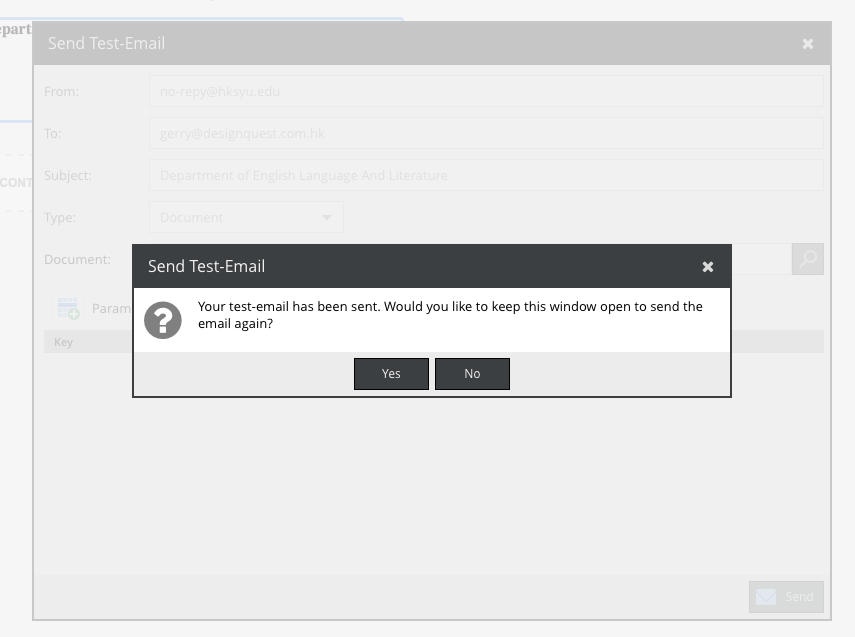

Received the mail in mail client

> To check the sent email record, please [click here](#check-sent-email-records)

## Get email parameters

Every email template may have their own parameters. Get the parameters from the form builder.

Here is an example:

Go to [formbuilder](forms/), select the form setting and open the field name.

`Name` is a parameter name.

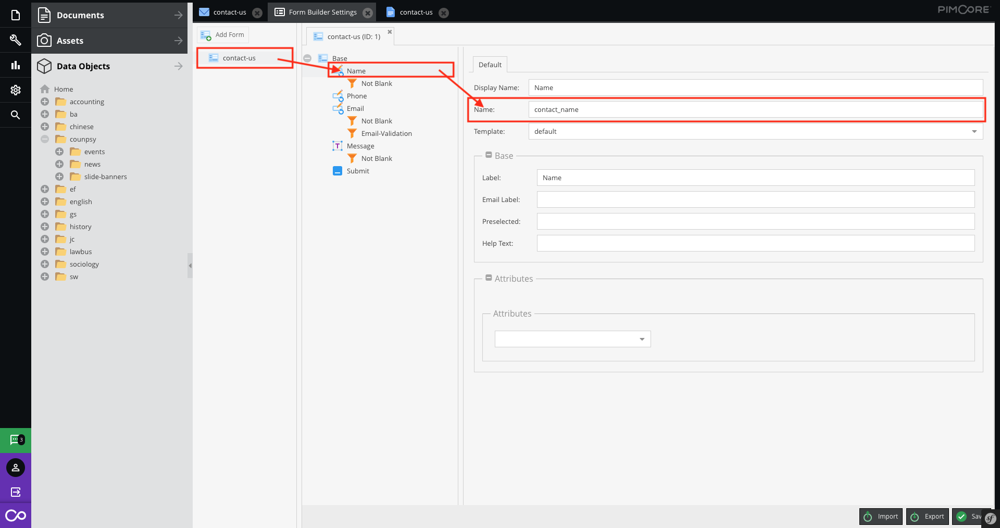

So, you can use it in your paragraph.

```
%Text(contact_name);
```

Use it in ckeditor or HTML mode

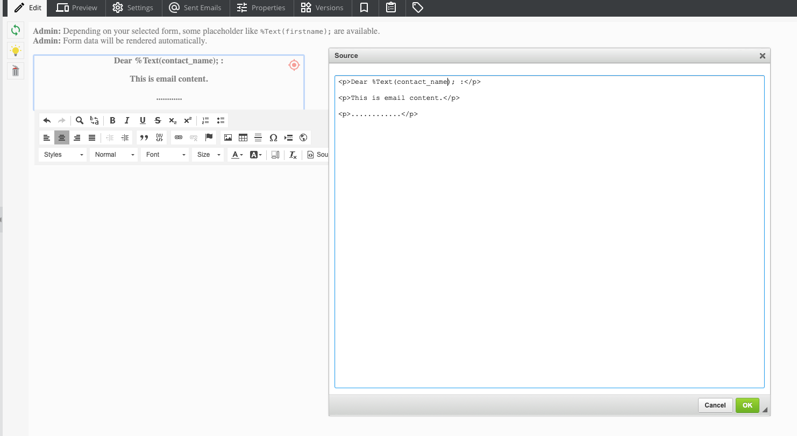

## Check sent email records 

There are two places that store the record of the email sender.  
[Global email record](#global-email-record)(All email templates) and [Single email record](#single-email-record)(One of the email templates).

### Global email record

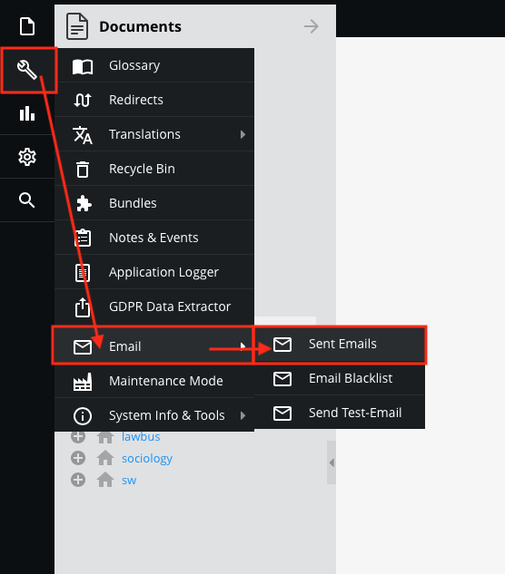

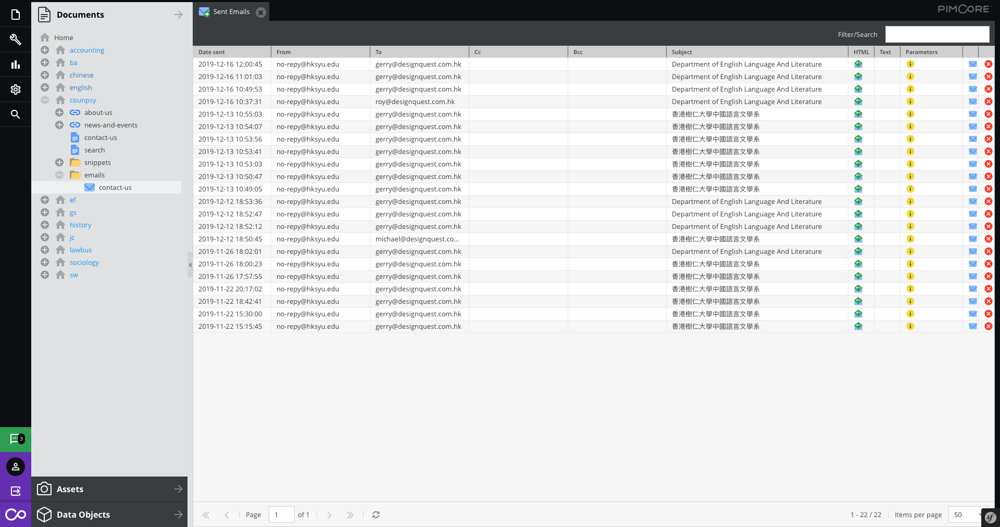

### Single email record

Open the email template, then select `Sent Emails` tab

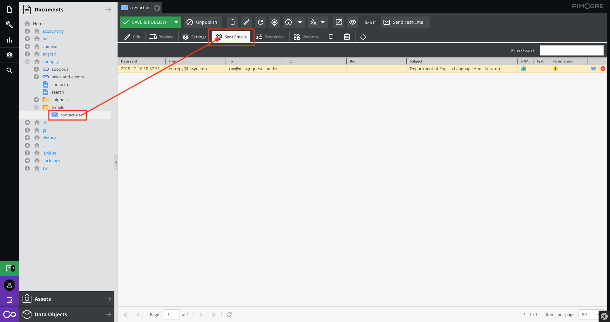

## Operation in email record list

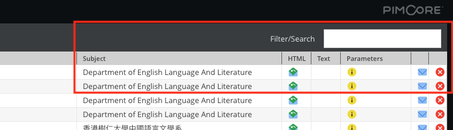

* **Filter and search**

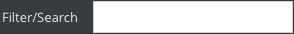 Search the email by the keywords.

* **Preview sent email**

 Preview the received email.

* **Check the parameters**

 Check the pararmeters of this email.

* **Resent**

 Send this email again.

* **Remove record**

 Click it and remove the sent record

> It can't restore when removed the record.