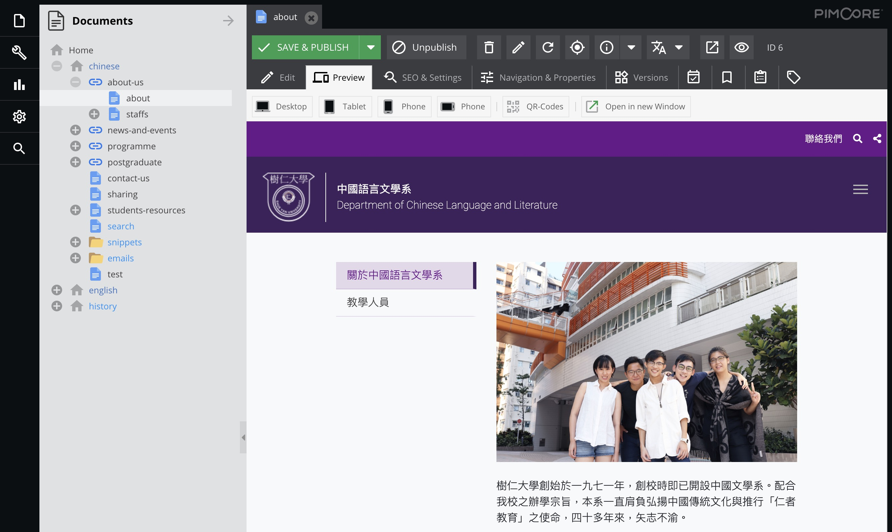

# The HKSYU CMS User Handbook

Welcome to the [HKSYU CMS](http://hksyu.dev.dq.hk/admin) user handbook. This document shows you how to use the CMS to manage the contents of HKSYU faculties And departments websites.

**The original documet published to https://hksyu-cms.firebaseapp.com/**

## The HKSYU faculties and departments websites
The following HKSYU faculties and departments websites are under the CMS management:

### Faculty of Arts
- [Department of Chinese Language and Literature](http://chinese.hksyu.dev.dq.hk/)
- [Department of English Language and Literature](http://english.hksyu.dev.dq.hk/)
- [Department of History](http://history.hksyu.dev.dq.hk/)
- [Department of Journalism and Communication](http://jc.hksyu.dev.dq.hk/)

### Faculty of Commerce
- [Department of Accounting](http://accounting.hksyu.dev.dq.hk/)
- [Department of Business Administration](http://ba.hksyu.dev.dq.hk/)
- [Department of Economics and Finance](http://ef.hksyu.dev.dq.hk/)
- [Department of Law and Business](http://lawbus.hksyu.dev.dq.hk/)

### Faculty of Social Sciences
- [Department of Counselling and Psychology](http://counpsy.hksyu.dev.dq.hk/)
- [Department of Social Work](http://sw.hksyu.dev.dq.hk/)
- [Department of Sociology](http://sociology.hksyu.dev.dq.hk/)

### Graduate School
- [Graduate School](http://gs.hksyu.dev.dq.hk/)

---
## About Design Quest
> This document and CMS was created by [Design Quest Limited](https://designquest.com.hk). If you have any questions or comments, please feel free to contact us: info@designquest.com.hk  

---
## Document Update
> Created: 2019-12-03 
> Updated: {docsify-updated}