# Content Block
A page consists of content blocks. You can click the <image src="documents/images/20.jpg" class="inline-img"> button to select and add a content block. 

## Accordion
The **Accordion** content block provides the following page layout  
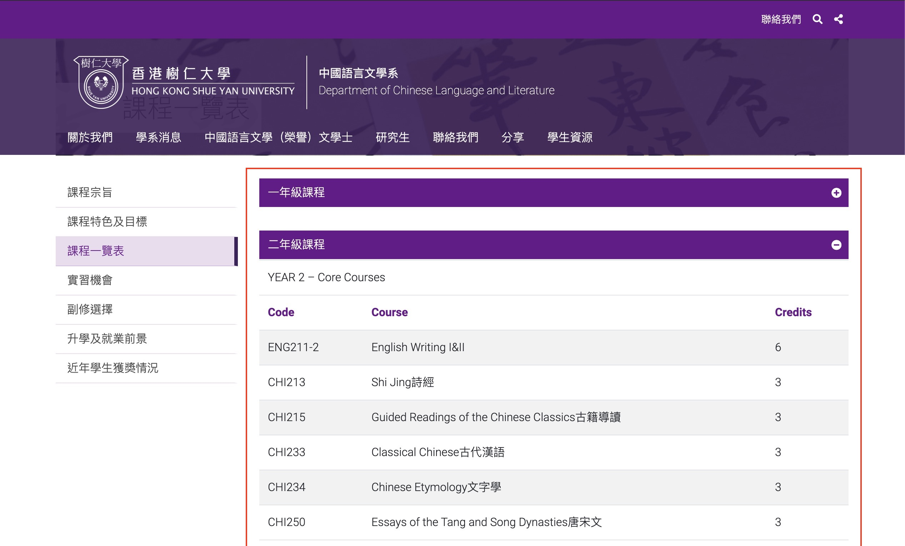

You can change **Accordion** settings according to the image below:
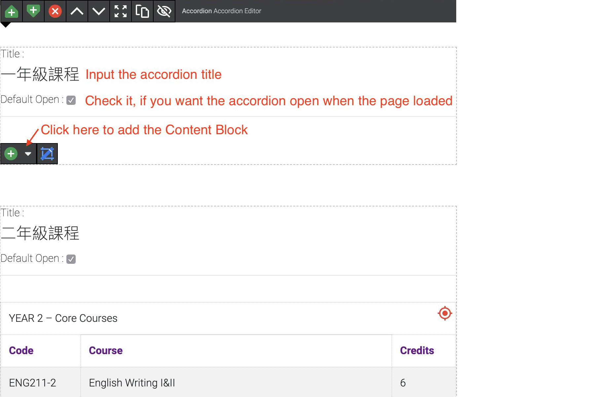

## EventsList
The **EventsList** content block will read the [Events Objects](/data-objects/events) and uses the following page layout to display them as a events index. 
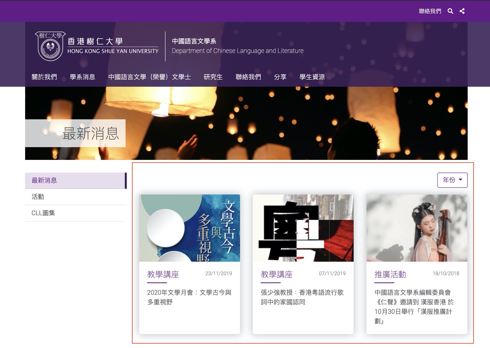

### Update Events List

Following the image below to add the events to the **EventsList**
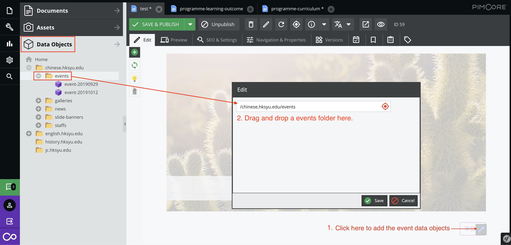

For how to carete/edit **Events Object**, please see [here](/data-objects/events).

## Form
The **Form** content block will read the [Forms](/forms/) from the FormBuilder and uses the following page layout to display it. 
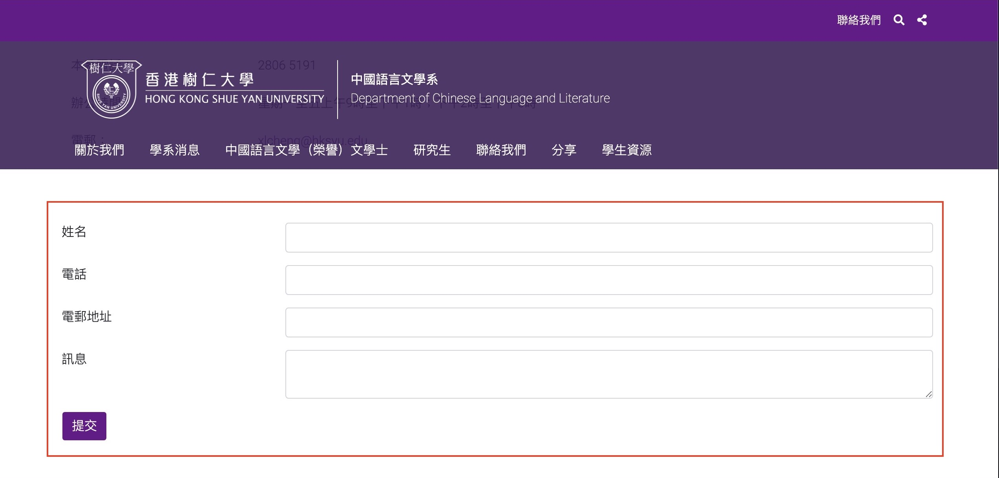

1. Click the <image src="documents/images/30.jpg" class="inline-img"> to setup the form
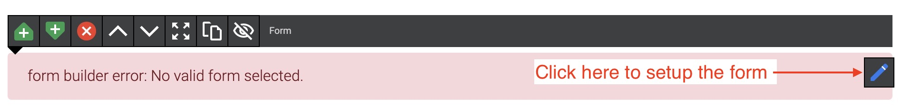

2. 
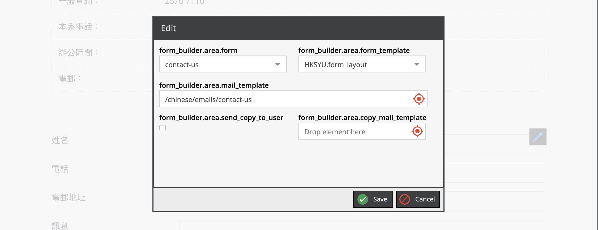

## HTML Editor
Use it to add HTML contents. Use the toolbar to adjust the contents

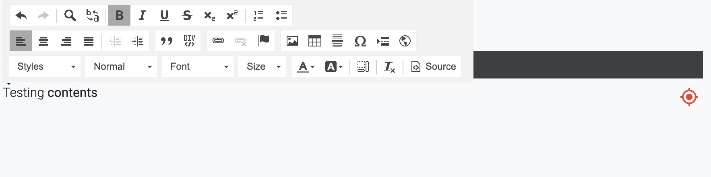

**Add internal hyperlink**: drag and drop a page from Documents menu to the content editor.
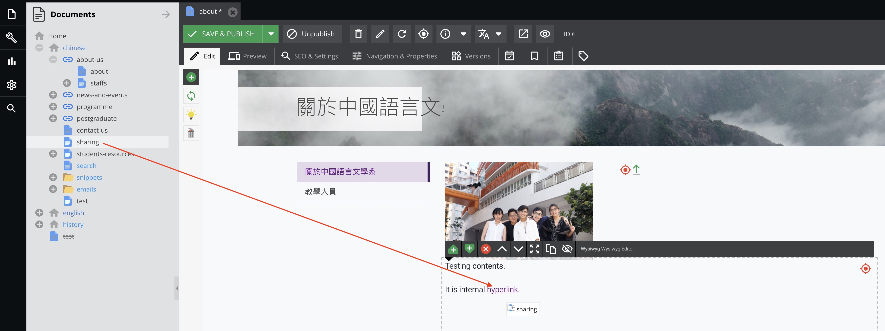

**Add image**: drag and drop a image from Assets menu to the content editor.
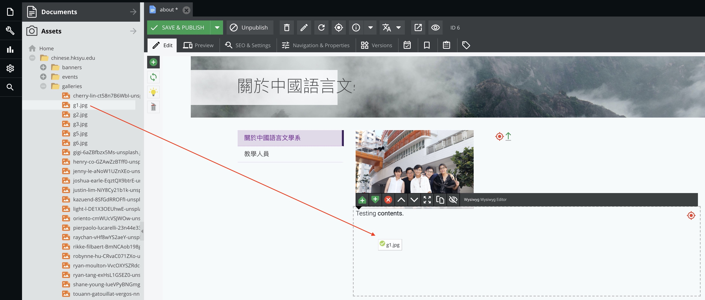
For how to upload/manage **Assests**, please see [here](/assets/).

## Image
The **Image** content block can add a responsive image to the page. 
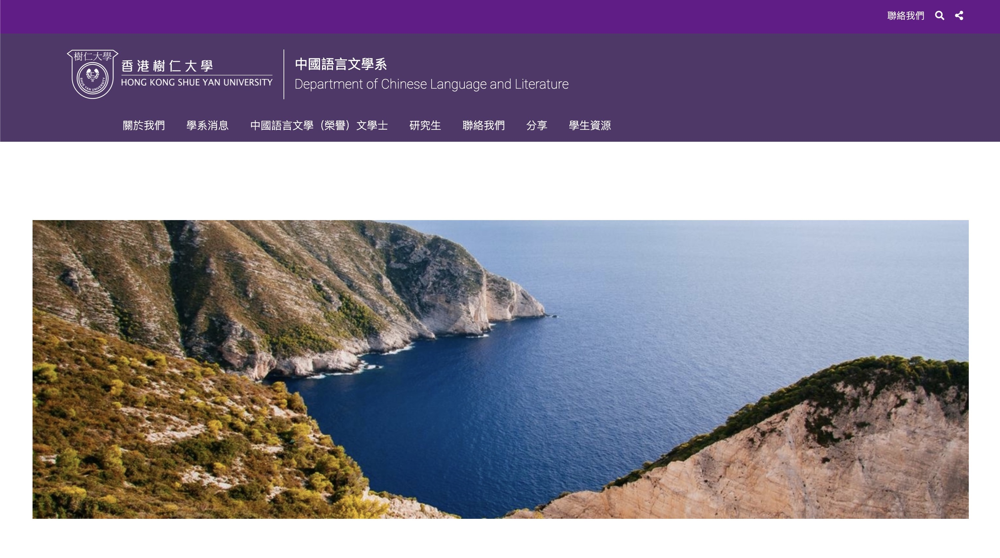

Following the image below to add a image assets
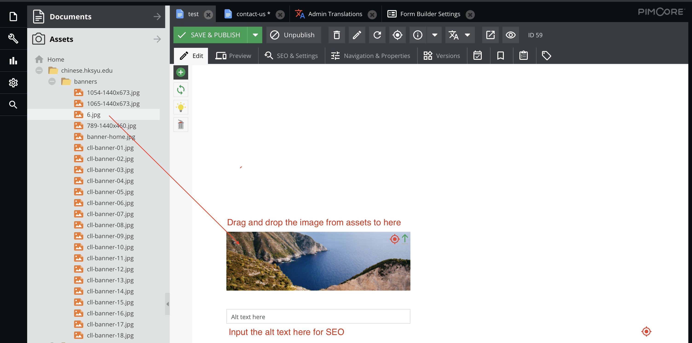

## News and Events
The **News and Events** content block will read the first 4 [Events Objects](/data-objects/events) and 3 most updated [News Objects](/data-objects/news) then uses the following page layout to display them.

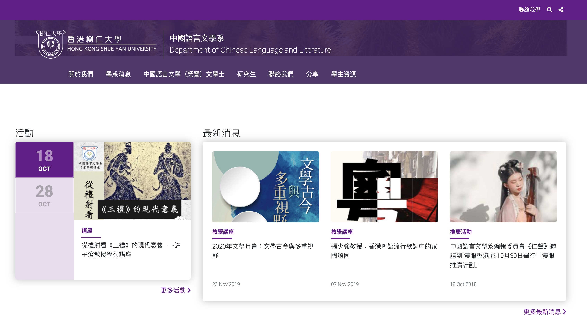

### Update the News and Events List
1. Click the <image src="documents/images/30.jpg" class="inline-img"> to setup the source of news and events
    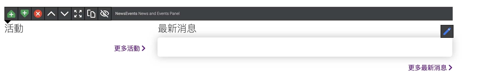

2. Drag and drop the news folder and events folder to the input fields then click save.
> Note: You must save event objects to events folder and news objects to news folder.
 
    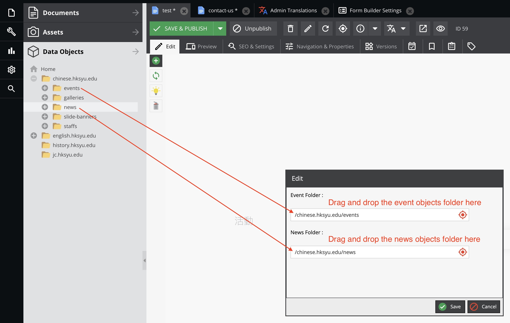

## News List
The **News** content block will read the [News Objects](/data-objects/news) then uses the following page layout to display them.

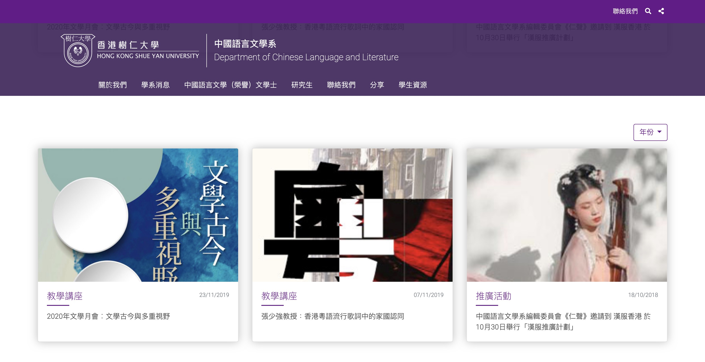

### Update the News List
1. Click the <image src="documents/images/30.jpg" class="inline-img"> to add/update the source of news
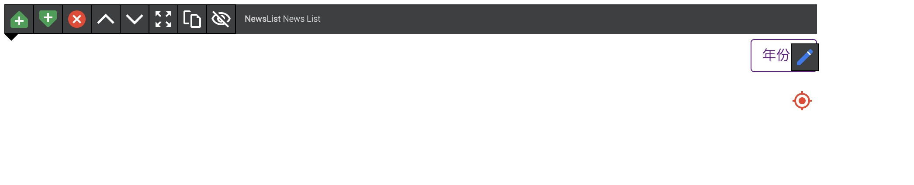

2. Drag and drop the news folder and events folder to the input fields then click save.
    > Note: You must save news objects to news folder.

    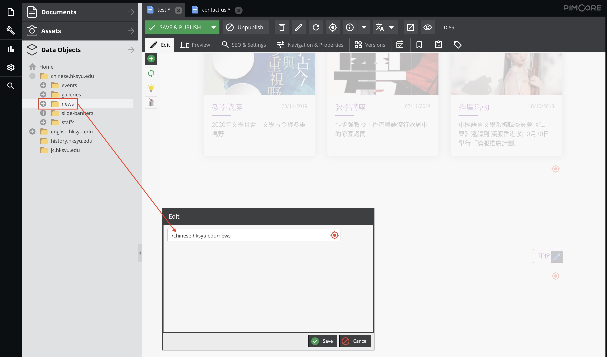

## Photo Wall

## Popup Window

## Slide Banner 

## Slide Gallery

## Staff List

## Table

## Text
