# Content Block
A page consists of content blocks. You can click the <image src="documents/images/20.jpg" class="inline-img"> button to select and add a content block. 

## Accordion
The **Accordion** content block provides the following page layout  

You can change **Accordion** settings according to the image below:

## EventsList
The **EventsList** content block will read the [Events Objects](/data-objects/events) and uses the following page layout to display them as a events index. 

#### Craete/update Events List

1. Click the <image src="documents/images/30.jpg" class="inline-img"> to add/update the source of events

2. Drag and drop the folder containing **Event** objects into the input fields then click save.

## Form
The **Form** content block will read the [Forms](/forms/) from the Form Builder and uses the following page layout to display it. 

1. Click the <image src="documents/images/30.jpg" class="inline-img"> to setup the form

2. Input the fields

## HTML Editor
Use it to add HTML contents. Use the toolbar to adjust the contents

**Add internal hyperlink**: drag and drop a page from Documents menu to the content editor.

**Add image**: drag and drop a image from Assets menu to the content editor.

For how to upload/manage **Assests**, please see [here](/assets/).

## Image
The **Image** content block can add a responsive image to the page. 

Following the image below to add a image assets

## News and Events
The **News and Events** content block will read the first 4 [Events Objects](/data-objects/events) and 3 most updated [News Objects](/data-objects/news) then uses the following page layout to display them.

#### Craete/update the News and Events List
1. Click the <image src="documents/images/30.jpg" class="inline-img"> to setup the source of news and events
    

2. Drag and drop the folders containing **News** objects and **Events** object into the input fields then click save.
 
    

## News List
The **News** content block will read the [News Objects](/data-objects/news) in the folder and uses the following page layout to display them.

#### Craete/update the News List
1. Click the <image src="documents/images/30.jpg" class="inline-img"> to add/update the source of news

2. Drag and drop the folder containing **News** objects into the input fields then click save.

    

## Photo Wall
The **Photo Wall** content block will read the [Gallery Objects](/data-objects/gallery) in the folder and uses the following page layout to display them.

#### Craete/update the Photo Wall
1. Click the <image src="documents/images/30.jpg" class="inline-img"> to add/update the source of photos
    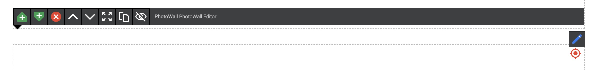

2. Drag and drop the folder containing **Gallery** objects into the input fields then click save.

    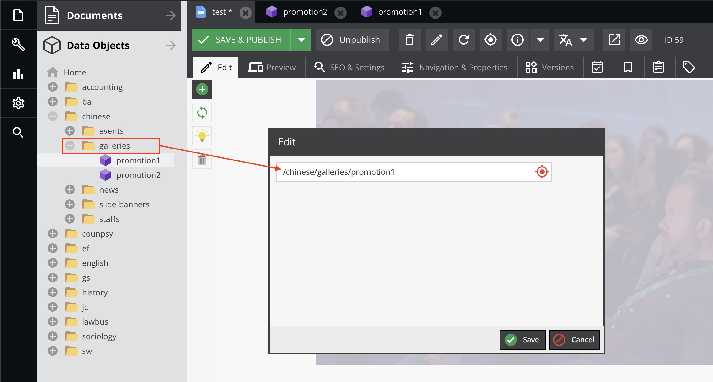

## Popup Window
The **Popup Window** content block will create a popup window in the page as below:

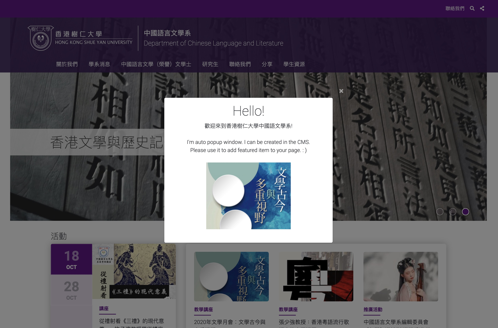

#### Craete/update the Popup Window
1. Add content to **Modal Content** input field

2. Checked the **Auto show when get into the page**, if you want the window will auto popup.

    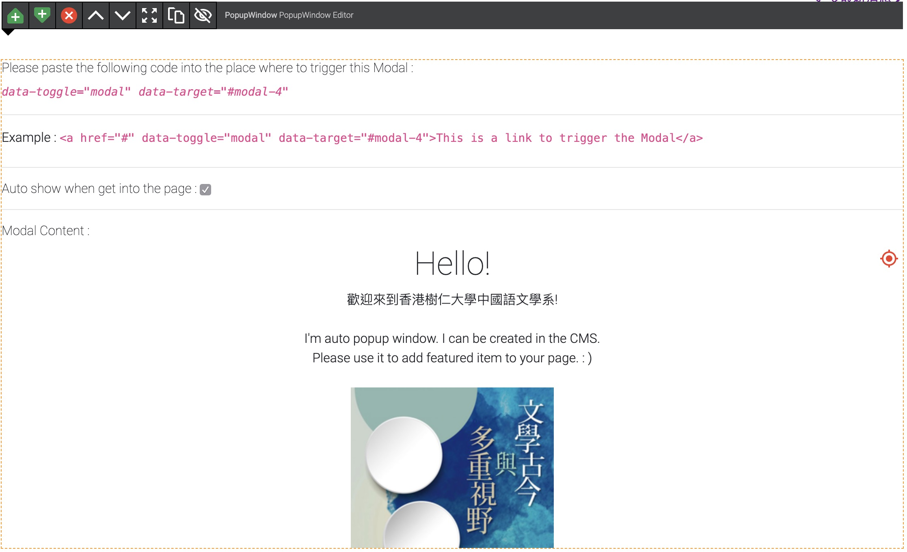

## Slide Banner
The **Slide Banner** content block will read the [SlideBanner Objects](/data-objects/slidebanner) in the folder and uses the following page layout to display them.

#### Craete/update the Slide Banner
1. Click the <image src="documents/images/30.jpg" class="inline-img"> to add/update the source of slide banners
    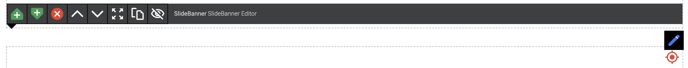

2. Drag and drop the folder containing **SlideBanner** objects into the input fields then click save.

    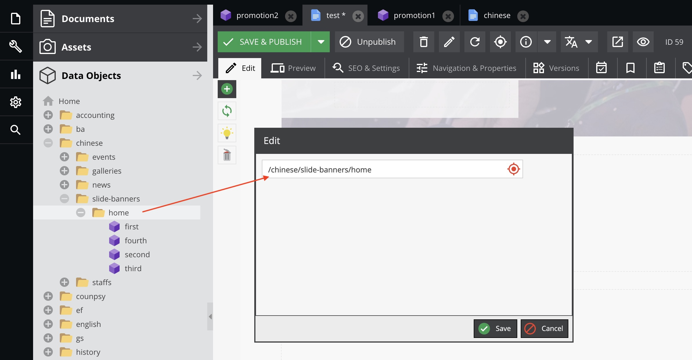

## Slide Gallery
The **Slide Gallery** content block will read the [Gallery Objects](/data-objects/gallery) in the folder and uses the following page layout to display them.

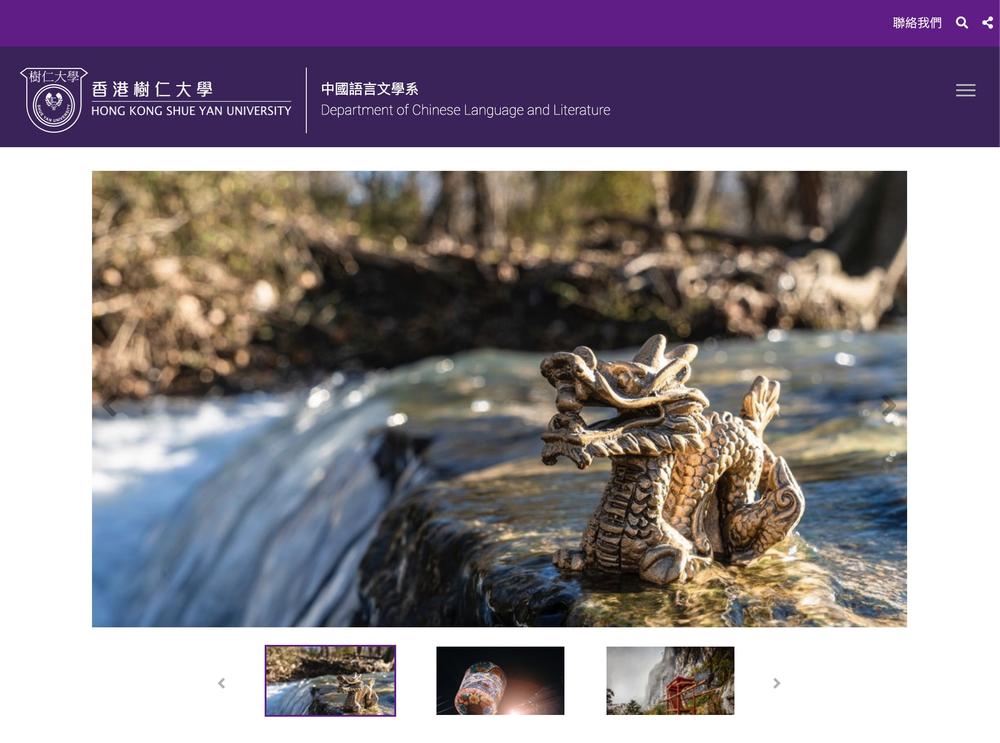

#### Craete/update the Slide Gallery
1. Click the <image src="documents/images/30.jpg" class="inline-img"> to add/update the source of slide gallery
    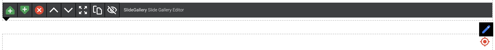

2. Drag and drop the folder containing **Gallery** objects into the input fields then click save.

    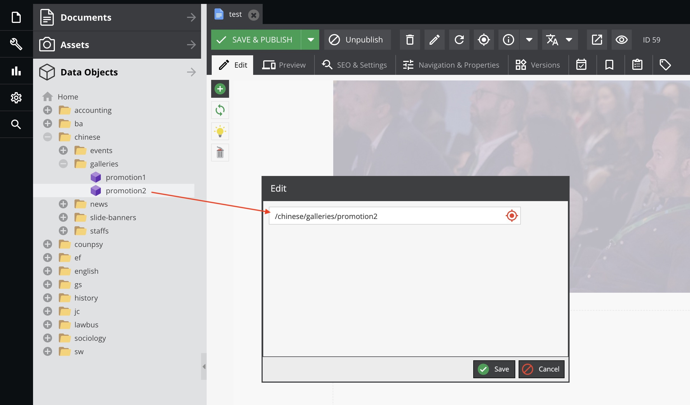

## Staff List
The **StaffList** content block will read the [Staff Objects](/data-objects/staff) in the folder and uses the following page layout to display them.

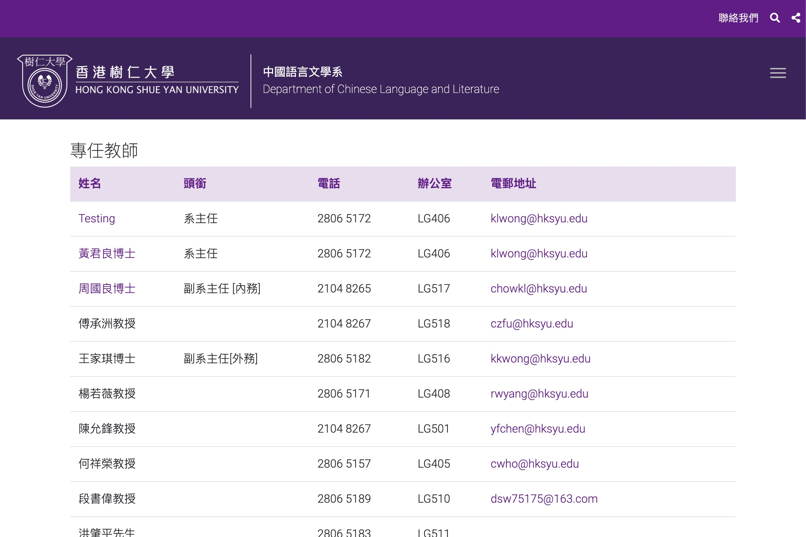

#### Craete/update the Staff List
1. Click the <image src="documents/images/30.jpg" class="inline-img"> to add/update the source of Staff List
    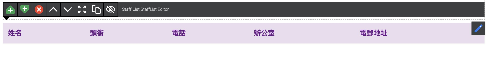

2. Input the staff group name to Title input field 
    Drag and drop the folder containing **Staff** objects into the Staffs Folder fields then click save.

    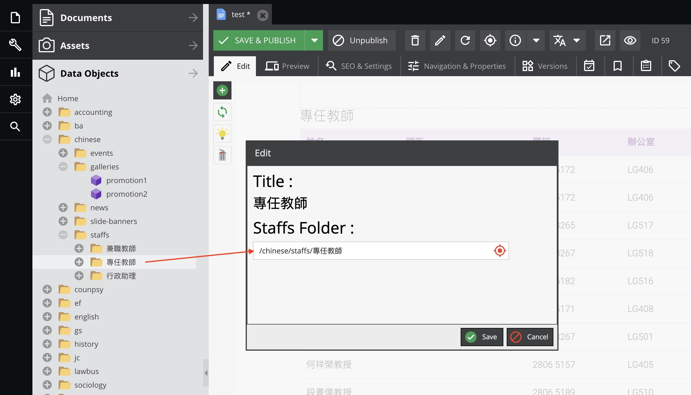
