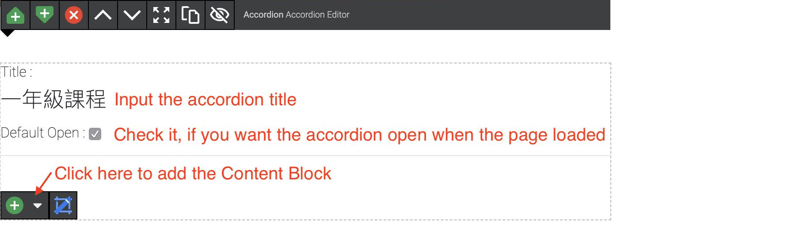

# Content Block
A page consists of content blocks. You can click the <image src="documents/images/20.jpg" class="inline-img"> button to add a content block. 

## Accordion
**Display**

**Add/Edit**

## EventsList
**Display**

**Add/Edit**

## Form

## Image

## Masonry

## Modal

## NewsEvents

## NewsList

## SlideBanner

## SlideGallery

## StaffList

## Table

## Text

## Wysiwyg
Add it to build HTML contents.

**Add internal hyperlink**: drag and drop a page from Documents menu to the content editor.

**Add image**: drag and drop a image from Assets menu to the content editor.

For how to upload/manage **Assests**, please see [here](/assets/).