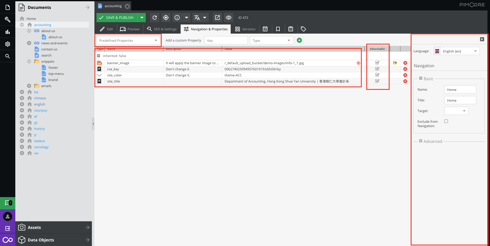
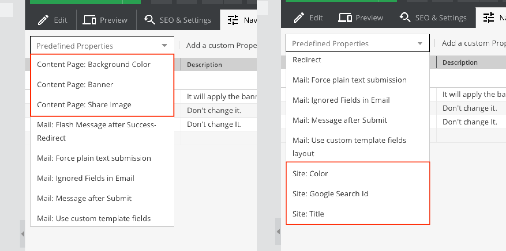
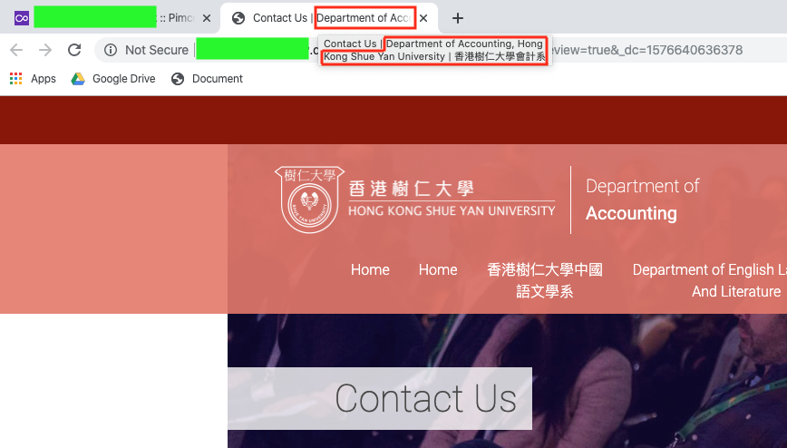
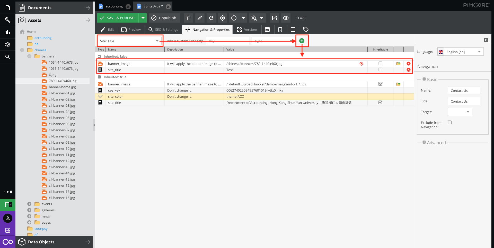

# Navigation & Properties

The properties could be used to specify some special behavior when the document is rendered.



## Predefinied Properties


We provided these pre properties to add or override the default properties.

- Content Page: Background Color  
This is for special case. We do not recommend to use it. Please use `site : color`

- Content Page: Banner  
The banner of each page can be replaced their own banner image.

- Content Page: Share Image  
Some social sharing contains the image(Thumbnail), such as Facebook or Whatsapp etc... You can apply a specific image to the page.

- Site : Color  
We defined some color scheme settings for client. These setting have the theme name. You can change the theme name to apply the theme in the current page and child pages(if checked the inhertable).  
If you dont have theme name list, please contact the provider/website admin to get it.

- Site : Google Search ID  
If this document has its own google search function, you can add this pre property to apply the google search id.

- Site : Title  

If you want to change text where is before the site title, please edit `Navigation` > `Title`

## Properties

Select the pre properties and click the add button.  
It shows below the list(inherited: false).
1. fill the text/ drag the assets file to the value field.  
2. check the inheritable if you need
3. save.



> `inherited: true` is properties from the parent page which are checked the inheritable checkbox. So, if you add again on this page, it will override the parent property.


```
Note: Anything changed, please click the save button!
```

## Inheritable
It means the child properties are the same as parent.

```
Note: Anything changed, please click the save button!
```

## Language  
Pimcore allows you to localize every document. You can find the setting in your document in the tab Properties. There you can choose from language which is configured in the system settings.

The selected language is registered as a property on the document, which is inherited to all of its children.

If you have selected a language this will be automatically set on your request object (if your program support) and is therefore automatically used for [shared translations](basic/translation), localized object lists and all other localized kind of contents.

> Go to shared translations, please [click here](basic/translation)

```
Note: Anything changed, please click the save button!
```

## Navigation
Pages and links have Navigation Settings in their system properties as shown in the screen above. These navigation settings include the following properties:

- Name  
Document's name used in the navigation (label).

- Title  
Document's title used in the navigation - the HTML Attribute title.

- Target  
Link target (_blank, _self, _top, _parent)

- Exclude  
from Navigation: Property to quickly exclude a page from the navigation.

```
Note: Anything changed, please click the save button!
```