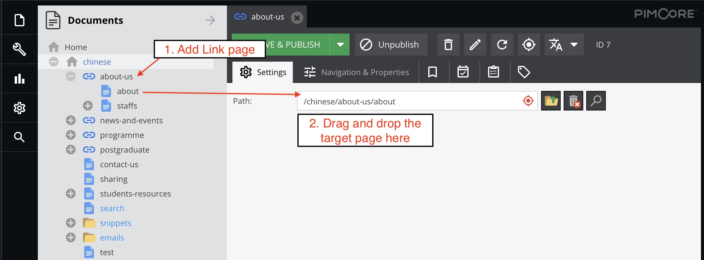

# Documents Menu

## Add page
    1. Right-click the folder in the documents tree menu and select the type of page you want to add. A new page will be added under the folder that you clicked.

    2. Fill the input the fields then click OK.
| Field      | Description                                          |
| ---------- | ---------------------------------------------------- |
| Key        | The page name to be shown in the documents tree menu |
| Navigation | The page name to be shown in the URL                 |
| Title      | The page name to be shown in the browser window      |

### Types of Content Page
You can choose the types of Content Page below: 

**Content Page width side menu**

**Content Page without side menu**

**Full Page Gallery**

## Add Link
You can create a **link** to redirect the user to other page.

The following example shows when user clicks the "about-us" in the navigation menu, the page will be redirected to "about-us/about" page.   

## Copy
Use it to copy a page or a folder of pages

## Paste
It pastes the copied pages to a new folder.

If you are copying a page, use **Paste as child**. 
If you are copying a folder, use **Paste as child(recursive)**.

## Publish and Unpublish page
If you want to hide a page temporarily, you can **Unpublish** it. 

## Arrange the navigation menu
You can drag and drop a page to new location. The changing will apply to the frontend website.
