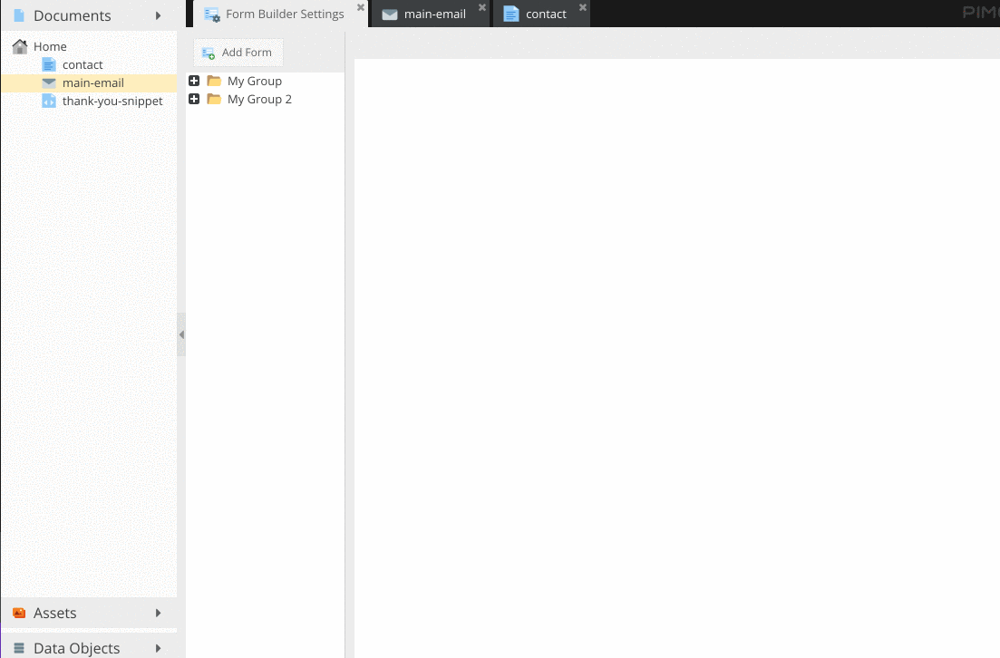

# Form Builder 
Go to Settings => **Form Builder Settings** and create your form.

## Create a form

## Add a from to your document
Add a [Form content block](/documents/content-blocks?id=form) to your document

> Important: It's possible to use multiple forms per page but never add the same form twice on the same page.

